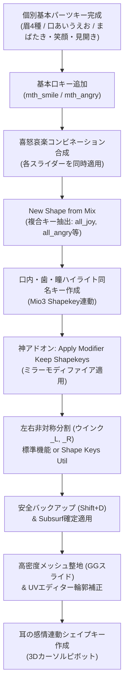

# ふさこ氏『Blenderでキャラクターモデル制作！』第37話 技術仕様書
## 03 | 喜怒哀楽などの表情シェイプキー

---

### 1. 動画情報概要

- **講義名**: 03 | 喜怒哀楽などの表情シェイプキー 〜中級者向けチュートリアル〜
- **動画URL**: [https://www.youtube.com/watch?v=ZbrGz3ma19I](https://www.youtube.com/watch?v=ZbrGz3ma19I)
- **動画ID**: `ZbrGz3ma19I`
- **再生時間**: 22分13秒 (1333秒)
- **主目的**:
  1. 口角の上げ下げによる基本口シェイプキー（`mth_smile`, `mth_angry`）の追加。
  2. これまでに作成した「眉毛・目・口」の各キーを組み合わせ、複合感情キー（喜・怒・哀・楽・驚き: `all_joy`, `all_angry`, `all_sorrow`, `all_surprise`）を `New Shape from Mix` で合成・抽出。
  3. 口内（歯・舌）および瞳ハイライトの完全自動シンクロ（Mio3 Shapekey連動）。
  4. **【超絶重要】シェイプキーを保持したままモディファイアを強制適用する神アドオン `Apply Modifier Keep Shapekeys` の導入と実践**。
  5. 左右対称シェイプキーから左右非対称な片側ウインク（`_L`, `_R`）を切り出す2大手法（Blender標準4ステップ vs 神アドオン `Shape Keys Util` ワンポチ手法）。
  6. Subdivision Surface（表面細分化）適用後の高密度メッシュにおける口角シワのスムージング（`G G` エッジスライド）と、UVエディターによる口輪郭線の途切れ・滲み補正。
  7. **【表現力爆上げ技】3Dカーソルを付け根ピボットにした耳の感情連動（ぴょこ跳ね・タレ耳）アニメーション**。

---

### 2. 表情シェイプキーの構造設計と全体ワークフロー

---

### 3. 詳細実装手順

#### ステップ1: 口角変化シェイプキーの作成（笑顔口・への字口）

1. **笑顔口 (`mth_smile`) の作成**:
   - 顔オブジェクトを選択し、シェイプキーリストの `+` ボタンを押して新規キーを作成。名前を `mth_smile` に変更。
   - スライダーの値を `1.0` に設定して編集モードに入る。
   - 口角の外側頂点を選択。キーボードの `.`（ピリオド）を押し、ピボットポイントを **`Active Element`**（アクティブ要素）に設定。
   - 口角を自然に斜め上方へ引き上げる。
   - [📸 参考: fusako37_01_blender_mouth_smile_active_element_planning.jpg](../../docs/fusako_37_emotions_shapekey_screenshots/fusako37_01_blender_mouth_smile_active_element_planning.jpg)
   - **【トポロジー歪みと修正方針】**:
     - Subsurf適用前のローポリゴン状態では、四角面が無理に歪んで斜めの不要な影線が発生する。この歪みは **後工程でSubdivision Surfaceを適用した後に `G G`（エッジスライド）で綺麗に整地する** ため、この段階では大まかなシルエット形成に集中して問題ない。
     - [📸 参考: fusako37_02_blender_mouth_smile_topology_crease_note.jpg](../../docs/fusako_37_emotions_shapekey_screenshots/fusako37_02_blender_mouth_smile_topology_crease_note.jpg)

2. **への字口 (`mth_angry`) の作成**:
   - 再び `+` ボタンで新規キーを作成し、名前を `mth_angry` に変更。
   - 口角頂点を選択（Active Elementピボット）、`S` キーまたは `G Z` で口角を下方に押し下げて不満そうなへの字口を形成。
   - [📸 参考: fusako37_03_blender_mouth_angry_pull_down_edges.jpg](../../docs/fusako_37_emotions_shapekey_screenshots/fusako37_03_blender_mouth_angry_pull_down_edges.jpg)
   - スライダーを動かして口元の不機嫌なニュアンスを確認。
   - [📸 参考: fusako37_04_blender_mouth_angry_shape_verification.jpg](../../docs/fusako_37_emotions_shapekey_screenshots/fusako37_04_blender_mouth_angry_shape_verification.jpg)

---

#### ステップ2: 喜怒哀楽コンビネーションシェイプキーの合成と抽出

眉・目・口の独立キーを組み合わせて、ワンアクションで表情全体を変化させる複合キーを作成する。

1. **喜び顔 (`all_joy`) の合成**:
   - `brow_fun` = `1.0`（楽しい眉）
   - `eye_smile` = `1.0`（笑い目）
   - `mth_smile` = `1.0`（笑顔口）
   - 3つのスライダーを同時に引き上げて笑顔を合成。
   - [📸 参考: fusako37_05_blender_combine_brow_eye_mouth_for_joy.jpg](../../docs/fusako_37_emotions_shapekey_screenshots/fusako37_05_blender_combine_brow_eye_mouth_for_joy.jpg)

2. **`New Shape from Mix` による複合キー抽出**:
   - シェイプキーリストの `V` 下矢印メニューをクリック $\to$ **`New Shape from Mix`** を選択。
   - 全スライダーを一括リセット（`X` ボタン）し、新規抽出されたキーの名前を `all_joy` に設定。
   - `all_joy` のスライダーを単独で動かし、眉・目・口が一括で連動することを確認。
   - [📸 参考: fusako37_06_blender_new_shape_from_mix_all_joy.jpg](../../docs/fusako_37_emotions_shapekey_screenshots/fusako37_06_blender_new_shape_from_mix_all_joy.jpg)

3. **別オブジェクト（口内・歯・瞳ハイライト）の完全自動同期**:
   - 口内・歯オブジェクト（`Mouth_Teeth`）を選択。
   - 顔と同じように口を開けたシェイプを適用した状態で `New Shape from Mix` を実行し、キー名を **`all_joy`** に統一。
   - [📸 参考: fusako37_07_blender_teeth_mouth_cavity_all_joy_sync.jpg](../../docs/fusako_37_emotions_shapekey_screenshots/fusako37_07_blender_teeth_mouth_cavity_all_joy_sync.jpg)
   - 瞳ハイライトオブジェクトを選択。笑い目でハイライトが隠れたり死んだりしないよう、ハイライトが適度に下がるキーを作成して名前を **`all_joy`** に統一。
   - これにより、顔メッシュの `all_joy` スライダーを動かすだけで、顔・口腔・歯・瞳の全オブジェクトがMio3 Shapekeyアドオンにより完全自動シンクロ駆動する！
   - [📸 参考: fusako37_08_blender_highlight_all_joy_motion_sync.jpg](../../docs/fusako_37_emotions_shapekey_screenshots/fusako37_08_blender_highlight_all_joy_motion_sync.jpg)

---

#### ステップ3: 【超絶重要】シェイプキー保持モディファイア適用アドオン

左右非対称の表情（ウインクなど）を作成するためには、左右対称のミラーモディファイアを適用（Apply）する必要がある。

1. **Blender標準機能の致命的制限**:
   - メッシュにシェイプキーが1つでも存在する場合、モディファイアプロパティから `Apply` を実行しようとすると、画面下に以下の赤字警告エラーが表示され、適用が拒絶される：
     > `Modifier cannot be applied to a mesh with shape keys`
   - [📸 参考: fusako37_09_blender_modifier_cannot_apply_shapekey_error.jpg](../../docs/fusako_37_emotions_shapekey_screenshots/fusako37_09_blender_modifier_cannot_apply_shapekey_error.jpg)

2. **救世主アドオン: `Apply Modifier Keep Shapekeys`**:
   - シェイプキーをすべて維持・計算したままモディファイアを安全にフリーズ適用できる神アドオン。
   - オブジェクトモード $\to$ 画面上部 `Object` メニュー $\to$ 最下部付近の **`Apply Chosen Modifiers`** を選択。
   - [📸 参考: fusako37_10_blender_apply_modifier_keep_shapekeys_addon.jpg](../../docs/fusako_37_emotions_shapekey_screenshots/fusako37_10_blender_apply_modifier_keep_shapekeys_addon.jpg)

3. **ミラーモディファイア適用の実行と環境復元**:
   - ポップアップで `Mirror` にチェックを入れ、`OK` をクリック。
   - **【注意点】**: アドオン実行後、オブジェクトの所属コレクションが変わる場合があるため、`M` キーで元のコレクション（例: `Head.001`）へ戻す。
   - 瞳などの別オブジェクトでミラー参照先が解除された場合は、ミラーモディファイアの `Mirror Object` スポイトで再度顔オブジェクトを指定する。
   - [📸 参考: fusako37_11_blender_mirror_apply_collection_fix.jpg](../../docs/fusako_37_emotions_shapekey_screenshots/fusako37_11_blender_mirror_apply_collection_fix.jpg)

---

#### ステップ4: 左右対称シェイプキーの非対称分割（ウインク作成）

ミラーが適用され実体ポリゴンとなったメッシュから、片目だけ閉じるウインクキー（`_L`, `_R`）を作成する。

- [📸 参考: fusako37_12_blender_asymmetric_wink_planning.jpg](../../docs/fusako_37_emotions_shapekey_screenshots/fusako37_12_blender_asymmetric_wink_planning.jpg)

##### 【手法A: Blender標準機能のみで行う手法（4ステップ）】
アドオンを導入できない環境でも確実にウインクを切り出せる基本技。
1. `eye_blink` を `1.0` にし、`New Shape from Mix` でキーを複製（2回行いL用とR用を作る）。
2. 編集モードに入り、**顔の中心軸上の頂点を1点アクティブ選択**。
3. 画面上部 `Select` $\to$ **`Side of Active`**（アクティブの側）を実行。画面左下のオペレータパネルで `Axis: Negative`（X負の方向、向かって左側）を指定すると、片半身の頂点のみが一括選択される。
   - [📸 参考: fusako37_13_blender_select_side_of_active_half_mesh.jpg](../../docs/fusako_37_emotions_shapekey_screenshots/fusako37_13_blender_select_side_of_active_half_mesh.jpg)
4. 画面上部 `Vertex` $\to$ **`Blend From Shape`** を実行。
   - `Shape`: **`Basis`**
   - `Add`: **OFF**（チェックを外す）
   - `Factor`: **`1.0`**
   - これにより、選択された片側頂点のみがBasis（初期開眼形状）に戻り、反対側だけが閉じたウインク `eye_blink_L` が完成！
   - 反対側は `Side of Active` で `Positive` を指定して同様に実行し、`eye_blink_R` を作成する。
   - [📸 参考: fusako37_14_blender_blend_from_shape_basis_wink_make.jpg](../../docs/fusako_37_emotions_shapekey_screenshots/fusako37_14_blender_blend_from_shape_basis_wink_make.jpg)

##### 【手法B: 神アドオン `Shape Keys Util`（BOOTH無料）によるワンポチ分割】
ふさこ氏が「めちゃくちゃ便利！」と絶賛する4ステップ一発自動化アドオン。
1. 対象の対称シェイプキー（例: `eye_smile`）を選択。
2. オブジェクトモードで右クリック $\to$ **`Shape Keys Util`** メニューを選択。
   - [📸 参考: fusako37_15_blender_shape_keys_util_booth_addon.jpg](../../docs/fusako_37_emotions_shapekey_screenshots/fusako37_15_blender_shape_keys_util_booth_addon.jpg)
3. **`Separate Shape Key Left and Right`** をクリック。
   - 設定で `Duplicate`: **ON** にしておく（元の両目キーを残したまま `_L` と `_R` が追加される）。
   - ワンクリックで `eye_smile_L` と `eye_smile_R`（ウインク）が瞬時に生成される！
   - [📸 参考: fusako37_16_blender_separate_shapekey_left_right_oneclick.jpg](../../docs/fusako_37_emotions_shapekey_screenshots/fusako37_16_blender_separate_shapekey_left_right_oneclick.jpg)

4. **瞳ハイライトの左右分割における注意点**:
   - ハイライトオブジェクトの原点がワールド中心（X=0）からずれていると、`Shape Keys Util` の左右判定が誤作動する。
   - 必ず事前に **`Ctrl + A` $\to$ `All Transforms`**（全トランスフォーム適用）を実行し、原点をワールド中心に合わせてから分割を実行すること。
   - [📸 参考: fusako37_17_blender_highlight_apply_all_transforms_split.jpg](../../docs/fusako_37_emotions_shapekey_screenshots/fusako37_17_blender_highlight_apply_all_transforms_split.jpg)

---

#### ステップ5: Subdivision Surface確定適用と高密度整地・UV補正

1. **不可逆作業前の安全バックアップ**:
   - Subsurf確定適用後は頂点数が跳ね上がり、低ポリケージに戻せなくなる。
   - 必ず顔メッシュを選択し、**`Shift + D` $\to$ `ESC`** でその場複製し、`M` キーでバックアップ用コレクションへ隔離退避しておく。
   - [📸 参考: fusako37_18_blender_backup_duplicate_before_subsurf_apply.jpg](../../docs/fusako_37_emotions_shapekey_screenshots/fusako37_18_blender_backup_duplicate_before_subsurf_apply.jpg)

2. **Subdivision Surfaceの確定適用**:
   - `Object` $\to$ `Apply Chosen Modifiers` から `Subdivision` を選択して適用。
   - **【適用エラーと回避策】**:
     - もしエラーで処理が中断する場合は、「あるシェイプキーの変形で中央の頂点がミラー結合してしまい、キーごとに頂点数が食い違っている」ことが原因。各キーのセンター結合状態を点検すること。
   - [📸 参考: fusako37_19_blender_keep_shapekeys_subsurf_apply_exec.jpg](../../docs/fusako_37_emotions_shapekey_screenshots/fusako37_19_blender_keep_shapekeys_subsurf_apply_exec.jpg)

3. **高密度メッシュによる口角シワの整地（`G G` エッジスライド）**:
   - Subsurf適用により頂点数が増加したため、歪んでいた口角の四角面を綺麗に再配置できる。
   - `mth_smile` または `mth_angry` を選択して編集モードへ。
   - 画面右上の **`X` 軸対称編集ボタンをON** にする。
   - 口角のシワ・えぐれ部分のエッジや頂点を複数選択し、**`G G`（エッジスライド）** でメッシュの曲面に沿って滑らかに移動。不自然な黒い影や段差を完全に解消する。
   - [📸 参考: fusako37_20_blender_gg_edge_slide_mouth_crease_smoothing.jpg](../../docs/fusako_37_emotions_shapekey_screenshots/fusako37_20_blender_gg_edge_slide_mouth_crease_smoothing.jpg)

4. **直した口角形状の `Blend From Shape` 部分統合**:
   - `mth_angry` 等で綺麗に直した口角ループを `Alt + Click` で選択 $\to$ `Ctrl + Num+` で選択範囲を拡大。
   - 複合キー `all_angry` を選択し、`Vertex` $\to$ `Blend From Shape`（Shape: `mth_angry`, Factor: 1.0）を実行。
   - これにより、複合キー側も一瞬で綺麗なシワなし口角に自動アップデートされる！
   - [📸 参考: fusako37_21_blender_blend_from_shape_update_all_expressions.jpg](../../docs/fusako_37_emotions_shapekey_screenshots/fusako37_21_blender_blend_from_shape_update_all_expressions.jpg)

5. **UVエディターによる口輪郭線の途切れ・滲み補正**:
   - 口を大きく開けた際に、テクスチャで描いた唇のアウトラインが途切れたり滲んだりする問題。
   - 画面を分割して `UV Editor` を表示。
   - 滲んでいる口角や輪郭部のUV頂点を少し内側へスライドさせることで、テクスチャの黒いリップラインが途切れず美しく繋がるよう補正。
   - [📸 参考: fusako37_22_blender_mouth_outline_uv_editor_alignment.jpg](../../docs/fusako_37_emotions_shapekey_screenshots/fusako37_22_blender_mouth_outline_uv_editor_alignment.jpg)

---

#### ステップ6: びっくり顔（`all_surprise`）の合成

1. 見開き目（`eye_surprise`）＋ 驚き眉（`brow_surprise`）＋ 「お」の口（`mth_O`）をスライダーで合成。
2. `New Shape from Mix` で `all_surprise` を作成。
3. 口腔・歯・瞳オブジェクトにも同名キー `all_surprise` を配備し、全パーツの一括同期を確認。
   - [📸 参考: fusako37_23_blender_all_surprise_full_facial_combo_sync.jpg](../../docs/fusako_37_emotions_shapekey_screenshots/fusako37_23_blender_all_surprise_full_facial_combo_sync.jpg)

---

#### ステップ7: 【表現力爆上げ】耳の感情連動シェイプキー

キャラクターの感情表現を極限まで豊かにするプロの隠し味技術。

1. **耳の付け根への3Dカーソル配置**:
   - 耳オブジェクトを選択し、新規シェイプキーを作成。
   - `T` キーでツールバーを出し、**`3D Cursor`** ツールを選択。
   - 耳の付け根（回転軸となる位置）をクリックして3Dカーソルを配置。
   - キーボードの `.`（ピリオド）を押し、ピボットポイントを **`3D Cursor`** に変更。
2. **喜び耳（ぴょこ跳ね）**:
   - プロポーショナル編集をON（スムーズ）にし、`R` キーで耳全体を斜め上前方へクイッと跳ね上げる。
   - キー名を顔の喜びキーと完全に同じ **`all_joy`** に設定！
   - 顔で `all_joy` を動かすと、耳がピョンと嬉しそうに跳ね上がる極上のアニメーションが実現。
3. **悲しみ耳（タレ耳）**:
   - 再び3Dカーソルピボットで `R` キーを使い、耳全体を力なく下垂させる。
   - キー名を **`all_sorrow`** に設定。
   - 顔の悲しみ表情と連動して耳がクタッと下がり、いじらしい感情が完璧に表現される。
   - [📸 参考: fusako37_24_blender_ear_emotional_bounce_3d_cursor_pivot.jpg](../../docs/fusako_37_emotions_shapekey_screenshots/fusako37_24_blender_ear_emotional_bounce_3d_cursor_pivot.jpg)

---

### 4. 必須アドオン一覧と設定要件

| アドオン名 | 入手先 | 役割・必須理由 |
|:---|:---|:---|
| **Apply Modifier Keep Shapekeys** | GitHub / 外部配布 | シェイプキーが存在するメッシュに対し、キーを破棄・変形させることなくミラーやSubsurfを安全に適用する |
| **Shape Keys Util** | BOOTH（無料配布） | 左右対称のシェイプキーからワンクリックで `_L` / `_R` の左右非対称キー（ウインク等）を自動生成する |
| **Mio3 Shapekey** | GitHub / 外部配布 | 顔・歯・舌・瞳ハイライト・耳など複数オブジェクト間で同名シェイプキーを完全同期駆動する |

---

### 5. トラブルシューティング＆落とし穴回避策

- **Q: `Apply Chosen Modifiers` でエラーが出て適用が中断する**
  - **A**: あるシェイプキーの作成中に中央頂点がX=0に吸着してしまい、Basisとシェイプキーで頂点数が食い違っていることが原因。各シェイプキーで中央頂点のマージや不要な頂点溶解が発生していないかをチェックする。
- **Q: `Shape Keys Util` で左右分割した時、ハイライトが片側に寄ってしまう**
  - **A**: ハイライトオブジェクトのオブジェクト原点がワールド中心からずれている。オブジェクトモードで `Ctrl + A` $\to$ `All Transforms` を実行して原点を (0, 0, 0) にリセットしてから再分割すること。
- **Q: 複合キー（`all_joy` 等）を作った後、口角の修正が反映されない**
  - **A**: 複合キーは作成時点のメッシュスナップショットであるため、後から `mth_smile` を直しても自動反映されない。直した口角頂点を選択し、`all_joy` 上で `Vertex > Blend From Shape`（Shape: `mth_smile`, Factor: 1.0）を実行して部分アップデートすること。
