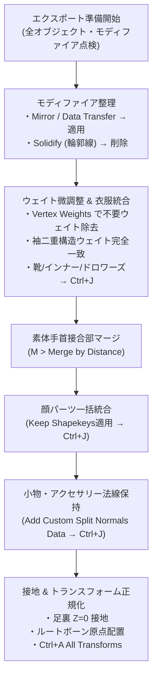

# ふさこ氏『Blenderでキャラクターモデル制作！』第39話 技術仕様書
## 01 | エクスポート前のオブジェクトとウェイト修正【エクスポート・法線調整編】

---

### 1. 動画情報概要

- **講義名**: 01 | エクスポート（オブジェクトとウェイト修正） 〜中級者向けチュートリアル〜
- **動画URL**: [https://www.youtube.com/watch?v=twg9e8ySFss](https://www.youtube.com/watch?v=twg9e8ySFss)
- **動画ID**: `twg9e8ySFss`
- **再生時間**: 26分14秒 (1574秒)
- **主目的**:
  1. ゲームエンジン（Unity / Unreal Engine）やVRM出力に向けた、ドローコール削減とパフォーマンス最適化のための「オブジェクト集約・統合（`Ctrl + J`）」パイプライン。
  2. 統合前に確定適用（Apply）すべきモディファイア（Mirror, Data Transfer, Lattice）と、**絶対に適用せず削除すべきモディファイア（Solidify 背面法輪郭線）の厳格な切り分け**。
  3. `Item > Vertex Weights` パネルを活用した、不要ボーンウェイト（Head/Neck）の数値特定・直接削除（`Remove`）および、頂点マスク（`V`）＋ウェイトペイントのスムーズ（Smooth）による滑らかな関節変形化。
  4. 衣服や袖の「二重構造（内側と外側）」におけるウェイト完全一致コピー（Copy）によるメッシュ貫通の完全根絶。
  5. 分割されていた素体（手と腕）の接合部頂点の一括溶着結合（`Merge by Distance`）。
  6. シェイプキーを持つ全顔パーツ（顔、口内、歯、舌、瞳、ハイライト、ハート目、星目、青ざめ）の `Apply Modifier Keep Shapekeys` 経由による安全な一括統合。
  7. **【超絶神技】オートスムースでシャープを付けた小物を統合する際、法線情報を消失させない `Add Custom Split Normals Data`（カスタム分割法線データ追加）の実践**。
  8. Unity向け命名規則（F2）、足裏のZ=0床面接地（`G Z`）、ルートボーンの原点配置、および全オブジェクトの **`Ctrl + A > All Transforms`（全トランスフォーム適用）による位置・回転・スケールの完全正規化**。

---

### 2. エクスポート前最適化の全体ワークフロー

---

### 3. 詳細実装手順

#### ステップ1: モディファイア適用と削除の厳格ルール

1. **Unityエクスポート前のオブジェクト統合方針**:
   - モデリング中は作業性を優先して数十個に分かれていたオブジェクトを、Unity等での描画負荷（ドローコール）を削減するため、同質マテリアルや部位ごとにグループ化して集約する。
   - [📸 参考: fusako39_01_blender_unity_export_object_merge_policy.jpg](../../docs/fusako_39_export_cleanup_screenshots/fusako39_01_blender_unity_export_object_merge_policy.jpg)
2. **モディファイア適用の鉄則**:
   - `Ctrl + J` でオブジェクトを統合すると、**「統合先の親オブジェクトが持っているモディファイア」しか残らない**。
   - そのため、各オブジェクトが独自に持っている `Mirror`（左右対称化）や `Data Transfer`（ウェイト転送）は、**統合する前に必ずすべて確定適用（Apply）しておく必要がある**。
   - [📸 参考: fusako39_02_blender_modifier_apply_before_merge_rules.jpg](../../docs/fusako_39_export_cleanup_screenshots/fusako39_02_blender_modifier_apply_before_merge_rules.jpg)
3. **パネル上での `Ctrl + A` による高速時短適用**:
   - モディファイアを1つずつプルダウンメニューから適用する代わりに、マウスカーソルをモディファイアパネルの上に置いた状態で **`Ctrl + A`** を押すと、瞬時に確定適用できる！
   - [📸 参考: fusako39_03_blender_ctrl_a_shortcut_on_modifier_panel.jpg](../../docs/fusako_39_export_cleanup_screenshots/fusako39_03_blender_ctrl_a_shortcut_on_modifier_panel.jpg)
4. **【最重要】Solidify（背面法輪郭線）モディファイアの削除**:
   - Blender内でプレビュー用に使っていた `Solidify`（裏返し法線アウトライン）は、**Unityへは絶対に持っていかない**。
   - Unity側のセルルックトゥーンシェーダー（UTS2、lilToon、Poiyomi等）がシェーダーパスで高品質なアウトラインを自動描画するため、BlenderのSolidifyは頂点数を倍化させる無駄な負荷となる。
   - すべてのオブジェクトから Solidify モディファイアを削除（または無効化）する。
   - [📸 参考: fusako39_04_blender_solidify_outline_remove_for_unity.jpg](../../docs/fusako_39_export_cleanup_screenshots/fusako39_04_blender_solidify_outline_remove_for_unity.jpg)
5. **アウトライナーでの高速モディファイア点検**:
   - アウトライナー上でオブジェクトを選択し、キーボードの `↓` / `↑` 矢印キーでテンポよく切り替えながら、モディファイアパネルに `Armature` 以外の余計なモディファイアが残っていないかを全数検査する。
   - [📸 参考: fusako39_05_blender_outliner_audit_ctrl_j_clothes_merge.jpg](../../docs/fusako_39_export_cleanup_screenshots/fusako39_05_blender_outliner_audit_ctrl_j_clothes_merge.jpg)

---

#### ステップ2: インナー・服・靴のウェイト微調整と統合

1. **Vertex Weightsパネルでの不要ウェイト特定**:
   - ポーズモードでアーマチュアの首や胸（Chest）ボーンを動かし、襟元や服が不自然に引っ張られないか点検。
   - 編集モードで引っ張られている頂点を選択し、`N` パネル $\to$ **`Item > Vertex Weights`** を確認。
   - 本来動くべきでない `Head`（頭）や `Neck`（首）のウェイトが乗っていることを特定する。
   - [📸 参考: fusako39_06_blender_vertex_weights_panel_head_neck_check.jpg](../../docs/fusako_39_export_cleanup_screenshots/fusako39_06_blender_vertex_weights_panel_head_neck_check.jpg)
2. **頂点グループからの不要ウェイト除去（Remove）**:
   - オブジェクトデータプロパティの頂点グループリストで `Head` または `Neck` を選択。
   - 影響を取り除きたい頂点を選択した状態で **`Remove`** ボタンをクリックし、不要なボーン影響を完全ゼロ化する。
   - [📸 参考: fusako39_07_blender_vertex_group_remove_unwanted_weights.jpg](../../docs/fusako_39_export_cleanup_screenshots/fusako39_07_blender_vertex_group_remove_unwanted_weights.jpg)
3. **頂点マスク（`V`）とウェイトペイントのスムーズ**:
   - ウェイトペイントモードに入り、**`V` キー** を押して「頂点マスクモード」をONにする。
   - 編集モードで選択しておいた境界頂点のみを対象にし、ブラシメニューから **`Weights > Smooth`**（スムーズ）を実行。
   - 首や肩の境界面が破綻なく滑らかに変形追従するよう整える。
   - [📸 参考: fusako39_08_blender_vertex_mask_v_weight_paint_smooth.jpg](../../docs/fusako_39_export_cleanup_screenshots/fusako39_08_blender_vertex_mask_v_weight_paint_smooth.jpg)
4. **服パーツの統合**:
   - 靴、ドロワーズ、インナーワンピースのミラーおよびデータ転送モディファイアを確定適用。
   - 複数選択して **`Ctrl + J`** で1つのオブジェクトに統合する。
   - [📸 参考: fusako39_09_blender_shoes_drawers_inner_merge_ctrl_j.jpg](../../docs/fusako_39_export_cleanup_screenshots/fusako39_09_blender_shoes_drawers_inner_merge_ctrl_j.jpg)

---

#### ステップ3: 素体メッシュの接合部溶着結合（Merge by Distance）

1. **手と腕の統合**:
   - 手メッシュと腕・脚の素体メッシュを `Ctrl + J` で統合。
2. **手首境界頂点の完全溶着**:
   - 手首の接合部エッジループを選択。
   - **`M` キー $\to$ `By Distance`**（距離でマージ）を実行。
   - 重なり合っていた二重頂点が1つに溶着され、隙間や切れ目のない水密な人体素体メッシュが完成する。
   - [📸 参考: fusako39_10_blender_wrist_boundary_merge_by_distance.jpg](../../docs/fusako_39_export_cleanup_screenshots/fusako39_10_blender_wrist_boundary_merge_by_distance.jpg)

---

#### ステップ4: アウター・袖・フードの二重ウェイト完全一致（貫通防止コピー技）

1. **アウター袖の二重データ転送適用**:
   - 体追従用のデータ転送と、袖揺らしボーン用のデータ転送の2つのモディファイアを確定適用。
   - ポーズモードで袖ボーンを曲げ、変形のカクつきを点検する。
   - [📸 参考: fusako39_11_blender_outer_sleeve_dual_data_transfer_apply.jpg](../../docs/fusako_39_export_cleanup_screenshots/fusako39_11_blender_outer_sleeve_dual_data_transfer_apply.jpg)
2. **【神技】袖内側と外側ウェイトの完全一致コピー（Copy）**:
   - セーターやアウターの袖口のような「厚みがある二重メッシュ構造」では、外側と内側でわずかでもウェイト値が食い違うと、腕を曲げた瞬間に内側のポリゴンが外側を突き破って貫通してしまう。
   - **解決手順**:
     1. 編集モードで内側頂点と外側頂点をペアで選択。
     2. `N` パネル `Vertex Weights` を開き、綺麗に変形している側の頂点ウェイトを確認。
     3. 最後に参照元頂点をアクティブ選択し、パネル内の **`Copy`** ボタンを押す！
     4. 内外の頂点ウェイトが100%完全一致するため、どんなに激しくボーンを曲げても絶対に貫通しなくなる！
   - [📸 参考: fusako39_12_blender_vertex_weights_copy_inner_outer_fix.jpg](../../docs/fusako_39_export_cleanup_screenshots/fusako39_12_blender_vertex_weights_copy_inner_outer_fix.jpg)
3. **フード下降時のシワ崩れ補正**:
   - フードを背中へ降ろした際、首裏のポリゴンが潰れてシワが寄る現象。
   - 変形がぐちゃっている領域を選択し、頂点マスク＋ウェイトペイントのスムーズをかけて、滑らかなドレープを描くように整地する。
   - 左右対称のミラーモディファイアを確定適用。
   - [📸 参考: fusako39_13_blender_hood_crease_mask_weight_smooth.jpg](../../docs/fusako_39_export_cleanup_screenshots/fusako39_13_blender_hood_crease_mask_weight_smooth.jpg)

---

#### ステップ5: 顔・特殊パーツの一括統合（Keep Shapekeysアドオン経由）

1. **特殊表情パーツへのウェイト割り当て**:
   - 前回作成したハート目、キラキラ目、青ざめメッシュを選択。
   - 頭部ボーン（`Head`）の頂点グループを作成し、全頂点にウェイト `1.0` を割り当てる（頭の動きに100%追従させる）。
   - [📸 参考: fusako39_14_blender_special_parts_weight_mirror_setup.jpg](../../docs/fusako_39_export_cleanup_screenshots/fusako39_14_blender_special_parts_weight_mirror_setup.jpg)
2. **Keep Shapekeysアドオンによるモディファイア確定適用**:
   - シェイプキーを持つオブジェクト（口内、歯、舌、耳、瞳、ハート目等）のミラーモディファイアを、**`Object > Apply Chosen Modifiers`** を使ってシェイプキーを壊さずにすべて適用する。
   - [📸 参考: fusako39_15_blender_apply_modifier_keep_shapekeys_face_parts.jpg](../../docs/fusako_39_export_cleanup_screenshots/fusako39_15_blender_apply_modifier_keep_shapekeys_face_parts.jpg)
3. **全顔面パーツの `Ctrl + J` 一括統合**:
   - 顔メッシュ、口内、歯、舌、瞳、ハイライト、ハート目、星目、青ざめメッシュをすべて複数選択。
   - **最後にメインの顔オブジェクト（`Face`）をアクティブ選択** して、**`Ctrl + J`** を実行！
   - 統合後、シェイプキーパネルの全スライダーをテストし、表情・あいうえお・特殊キーがすべて正常に連動動作することを確認する。
   - [📸 参考: fusako39_16_blender_face_teeth_eyes_special_ctrl_j_merge.jpg](../../docs/fusako_39_export_cleanup_screenshots/fusako39_16_blender_face_teeth_eyes_special_ctrl_j_merge.jpg)

---

#### ステップ6: 小物・アクセサリーのウェイト転送と【神技】法線保持

1. **ポーズ初期化（Rest Position）でのデータ転送適用**:
   - ポーズモードでボーンが傾いたままデータ転送を適用すると、ウェイト座標が歪んでしまう。
   - 必ずポーズモードで全選択（`A`）$\to$ **`Alt + R`（回転リセット）＋ `Alt + G`（位置リセット）** で初期姿勢に戻してから、データ転送モディファイアを適用すること。
   - [📸 参考: fusako39_17_blender_alt_r_alt_g_pose_reset_accessory_transfer.jpg](../../docs/fusako_39_export_cleanup_screenshots/fusako39_17_blender_alt_r_alt_g_pose_reset_accessory_transfer.jpg)
2. **ポシェットのデータ転送設定**:
   - ポシェットにデータ転送モディファイアを追加。
   - `Source`: アウターオブジェクト
   - `Vertex Data`: ON $\to$ `Vertex Groups`: ON
   - `Mapping`: **`Nearest Face Interpolated`**（最近接面の補間）
   - `Generate Data Layers` を押し、確定適用する。
   - [📸 参考: fusako39_18_blender_pochette_data_transfer_nearest_face.jpg](../../docs/fusako_39_export_cleanup_screenshots/fusako39_18_blender_pochette_data_transfer_nearest_face.jpg)
3. **小物モディファイア適用とラティス削除**:
   - 羽やポシェット紐のミラー・モディファイアを適用。
   - 変形に使用していたラティス（Lattice）オブジェクトは不要になるため、別コレクションへ隔離するか削除する。
   - [📸 参考: fusako39_19_blender_accessory_modifiers_apply_lattice_cleanup.jpg](../../docs/fusako_39_export_cleanup_screenshots/fusako39_19_blender_accessory_modifiers_apply_lattice_cleanup.jpg)
4. **【超絶神技】`Add Custom Split Normals Data` によるオートスムース法線保持**:
   - **【大問題】**: パッチン留め（ヘアピン）のように「Auto Smooth（オートスムース）」で角度によるシャープ付けを行っていた小物を、他のパーツ（髪リボン等）と `Ctrl + J` で統合すると、オートスムースの設定角度が上書きされ、エッジのシャープ情報が消えて丸まってしまう！
   - **【解決手順】**:
     1. パッチン留めオブジェクトを選択。
     2. オブジェクトデータプロパティ $\to$ **`Geometry Data`**（ジオメトリデータ）パネルを開く。
     3. **`Add Custom Split Normals Data`**（カスタム分割法線データを追加）をクリック！
     4. すると、オートスムースによる角度情報が、メッシュの各エッジに「マークシャープ（Mark Sharp）」として固定焼き込みされる！
     5. この状態で `Ctrl + J` で統合すれば、オートスムース角に依存することなく、シャープな金属・プラスチックの陰影が100%完全維持される！
   - [📸 参考: fusako39_20_blender_add_custom_split_normals_data_preservation.jpg](../../docs/fusako_39_export_cleanup_screenshots/fusako39_20_blender_add_custom_split_normals_data_preservation.jpg)
   - 統合後も美しいマークシャープが維持されていることを確認。
   - [📸 参考: fusako39_21_blender_mark_sharp_preserved_ctrl_j_merge.jpg](../../docs/fusako_39_export_cleanup_screenshots/fusako39_21_blender_mark_sharp_preserved_ctrl_j_merge.jpg)

---

#### ステップ7: コレクション整理・Unity命名規則・接地・全トランスフォーム適用

1. **Unity向け命名規則（`F2`）**:
   - Unityプロジェクト内で複数キャラクターをインポートした際、名前が単に `Hair` や `Body` だとアセット衝突や識別不能を引き起こす。
   - `F2` キーで、**「キャラクター名＋部位名」** の規則でリネームする：
     - 例: `Chara_Face`, `Chara_Body`, `Chara_Clothes`, `Chara_Hair`, `Chara_Accessory`, `Chara_Armature`
   - 不要になった作業用コレクションはすべて削除（`X`）し、1つのメインコレクションへ集約。
   - [📸 参考: fusako39_22_blender_unity_naming_convention_f2_rename.jpg](../../docs/fusako_39_export_cleanup_screenshots/fusako39_22_blender_unity_naming_convention_f2_rename.jpg)
2. **足裏のZ=0床面接地とルートボーン原点配置**:
   - キャラクターの足が床下にめり込んでいるのを防ぐため、全オブジェクトを選択し、**足裏がグリッド床面（Z=0.0）にぴったり乗るように `G Z` で上方に配置** する。
   - アーマチュアの編集モードに入り、**ルートボーン（`Root`）のHeadのZ座標をピタリ `0.0`（ワールド原点）にスナップ配置** する。
   - [📸 参考: fusako39_23_blender_ground_contact_gz_root_bone_origin_fix.jpg](../../docs/fusako_39_export_cleanup_screenshots/fusako39_23_blender_ground_contact_gz_root_bone_origin_fix.jpg)
3. **全トランスフォーム適用（`Ctrl + A > All Transforms`）**:
   - すべてのオブジェクト（メッシュおよびアーマチュア）を選択。
   - **`Ctrl + A` $\to$ `All Transforms`（全トランスフォーム適用）** を実行！
   - これにより、全パーツの `Location` が (0, 0, 0)、`Rotation` が (0, 0, 0)、`Scale` が (1.0, 1.0, 1.0) に完全正規化され、ゲームエンジンインポート時のスケール100倍バグや位置ズレが永久に防止される。
   - [📸 参考: fusako39_24_blender_ctrl_a_all_transforms_normalization.jpg](../../docs/fusako_39_export_cleanup_screenshots/fusako39_24_blender_ctrl_a_all_transforms_normalization.jpg)

---

### 4. エクスポート直前チェックリスト

| 検査項目 | 合格基準 | 確認方法 |
|:---|:---|:---|
| **モディファイア残存** | `Armature` のみ残っていること（Solidifyは完全削除） | アウトライナーで各オブジェクトを `↓`/`↑` 点検 |
| **素体接合部** | 手首や首が一体化（水密）していること | 編集モードで `L` キー選択、`Merge by Distance` 実行 |
| **二重メッシュ貫通** | 袖や服の内側が外側を突き破らないこと | `Vertex Weights` パネルで内外ウェイト完全一致コピー |
| **シャープ法線** | 小物統合後もエッジが丸まらずシャープなこと | `Add Custom Split Normals Data` 適用確認 |
| **シェイプキー** | 顔統合後も全感情・口形状キーが正常連動すること | シェイプキーのスライダーをテスト動作 |
| **床面接地** | 足裏がZ=0に接地し、Rootボーンが (0,0,0) にあること | 真正面ビュー（テンキー1）でグリッド原点を確認 |
| **トランスフォーム値** | 全オブジェクトのLoc/Rotが0、Scaleが1であること | `N` パネルのTransformで `(0,0,0)/(0,0,0)/(1,1,1)` を確認 |
