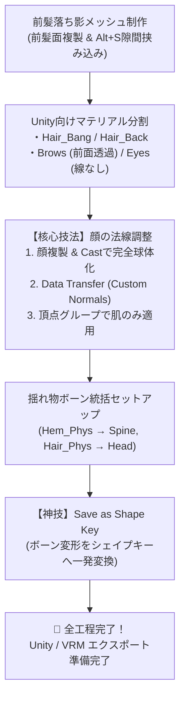

# ふさこ氏『Blenderでキャラクターモデル制作！』第40話 技術仕様書
## 02 | 顔の法線調整と前髪の影つけ【チュートリアル完結記念・最終回】

---

### 1. 動画情報概要

- **講義名**: 02 | 顔の法線と前髪の影つけ 〜中級者向けチュートリアル〜
- **動画URL**: [https://www.youtube.com/watch?v=WtaMWiaDDLY](https://www.youtube.com/watch?v=WtaMWiaDDLY)
- **動画ID**: `WtaMWiaDDLY`
- **再生時間**: 22分11秒 (1331秒)
- **主目的**:
  1. イラストやアニメで定番の「前髪から額に落ちる美しいシャドウ（落ち影）」を再現する板ポリメッシュのモデリングと配置。
  2. Unityのトゥーンシェーダー（lilToon, UTS2等）で「前髪越しに眉・目を透かす」「不要な落ち影を無効化する」「特定パーツのアウトラインを消す」ための精密なマテリアルスロット分割設計。
  3. **【超絶重要・アニメ調モデリングの最高峰】顔の立体凹凸（鼻や口元）による汚いギザギザ影を根絶し、滑らかなアニメ陰影を実現する「Cast球体化 $\to$ Data Transfer（カスタム分割法線転送）」パイプライン**。
  4. UnityのDynamicBone / VRC PhysBone向けに、裾や髪の揺れ物ボーン群を統括する親ボーン（`Hem_Phys`, `Hair_Phys`）の階層セットアップ。
  5. **【神技】ボーンでポーズをつけた形状をワンクリックで表情・感情シェイプキーへ変換する `Armature > Save as Shape Key`（シェイプキーとして保存）**。

---

### 2. セルルックアニメ表現の極致（全体ワークフロー）

---

### 3. 詳細実装手順

#### ステップ1: 前髪の落ち影（板ポリ）メッシュの制作と配置調整

1. **前髪面の複製と分離**:
   - 前髪メッシュを選択して編集モードへ。
   - 額に落ちる影の元となる前髪の裏面・下端付近の面を選択。
   - `Shift + D` $\to$ `ESC` でその場複製し、`P` キー $\to$ `Selection` で別オブジェクトに分離する。
   - [📸 参考: fusako40_01_blender_bangs_shadow_mesh_concept_duplicate.jpg](../../docs/fusako_40_face_normals_shadow_screenshots/fusako40_01_blender_bangs_shadow_mesh_concept_duplicate.jpg)
2. **`Alt + S` による収縮と隙間挟み込み**:
   - 分離した影メッシュを選択。マテリアルを一旦外して見やすくする。
   - 編集モードで全選択し、**`Alt + S`**（法線に沿って収縮）を実行。
   - 前髪と額の間の狭い隙間にぴったり収まるよう、わずかに内側に縮める。
   - [📸 参考: fusako40_02_blender_alt_s_shrink_shadow_plane_fit.jpg](../../docs/fusako_40_face_normals_shadow_screenshots/fusako40_02_blender_alt_s_shrink_shadow_plane_fit.jpg)
3. **影メッシュの軽量化とミラー設定**:
   - 影メッシュには複雑な厚みや裏面は不要なため、見えない不要ポリゴンを削除して1枚の板ポリ構造に整理。
   - 片側半分を削除し、`Mirror` モディファイア（対象: 顔）を適用して左右対称化。
   - [📸 参考: fusako40_03_blender_shadow_mesh_mirror_simplify.jpg](../../docs/fusako_40_face_normals_shadow_screenshots/fusako40_03_blender_shadow_mesh_mirror_simplify.jpg)
4. **正面ビューでのチラ見え配置調整**:
   - 真正面ビュー（テンキー `1`）から見て、前髪の下端から影がほんの少しだけ覗くように頂点を微調整。
   - サイドの先端は髪と顔の間に自然に潜り込ませる。
   - [📸 参考: fusako40_04_blender_shadow_subtle_peeking_placement.jpg](../../docs/fusako_40_face_normals_shadow_screenshots/fusako40_04_blender_shadow_subtle_peeking_placement.jpg)
5. **形状確定と前髪への統合**:
   - 影メッシュのミラーモディファイアを確定適用。
   - 前髪オブジェクトを選択して **`Ctrl + J`** で統合。
   - 影用マテリアルに半透明テクスチャ（Inkscape等で描いたソフトな影グラデーション）を割り当てる。
   - [📸 参考: fusako40_05_blender_shadow_mesh_mirror_apply_merge.jpg](../../docs/fusako_40_face_normals_shadow_screenshots/fusako40_05_blender_shadow_mesh_mirror_apply_merge.jpg)

---

#### ステップ2: Unityトゥーンシェーダー向けマテリアル分割設計

Unity内でマテリアルごとに異なるシェーダープロパティ（透過、ステンシル、影無効、輪郭線制御）を設定するため、Blender側でマテリアルスロットを目的別に細分化しておく。

- [📸 参考: fusako40_06_blender_unity_toon_shader_material_separation_plan.jpg](../../docs/fusako_40_face_normals_shadow_screenshots/fusako40_06_blender_unity_toon_shader_material_separation_plan.jpg)

1. **髪の毛の分割 (`M_Hair_Bang` vs `M_Hair_Back`)**:
   - 前髪越しに眉毛や目を透かして描画したい場合、前髪だけを別のシェーダー設定にする必要がある。
   - 前髪部分を `L` キーで選択し、新スロット **`M_Hair_Bang`** にアサイン（Assign）。後頭部側の髪は **`M_Hair_Back`** とする。
   - [📸 参考: fusako40_07_blender_hair_bang_and_back_material_assign.jpg](../../docs/fusako_40_face_normals_shadow_screenshots/fusako40_07_blender_hair_bang_and_back_material_assign.jpg)
2. **透過シェーダーノードの整理**:
   - Shader Editorで透過テクスチャを整理。`Image Texture` の `Color` を `Principled BSDF` の `Base Color` に、`Alpha` を `Alpha` に接続。
   - マテリアル設定の `Blend Mode` を `Alpha Hashed`（または `Alpha Blend`）に設定。
   - [📸 参考: fusako40_08_blender_transparent_shader_node_hookup.jpg](../../docs/fusako_40_face_normals_shadow_screenshots/fusako40_08_blender_transparent_shader_node_hookup.jpg)
3. **眉毛の分割 (`M_Brows`)**:
   - アニメ特有の「前髪の上に眉毛が透けて見える表現」を行うため、眉毛メッシュを `L` キーで選択し、新スロット **`M_Brows`** にアサイン。
   - [📸 参考: fusako40_09_blender_brows_material_separation_front_render.jpg](../../docs/fusako_40_face_normals_shadow_screenshots/fusako40_09_blender_brows_material_separation_front_render.jpg)
4. **瞳・白目の分割 (`M_Eyes`)**:
   - 瞳や白目に不自然な輪郭線（アウトライン）が出たり、落ち影が落ちたりするのを防ぐため、瞳・白目メッシュを新スロット **`M_Eyes`** にアサイン。
   - [📸 参考: fusako40_10_blender_eyes_material_separation_no_outline.jpg](../../docs/fusako_40_face_normals_shadow_screenshots/fusako40_10_blender_eyes_material_separation_no_outline.jpg)

---

#### ステップ3: 【超絶重要】アニメ顔の法線調整（球体法線転送パイプライン）

アニメキャラクターの3Dモデルで最も重要な工程。鼻や口のリアルな立体凹凸があると、光が斜めから当たった際に頬や鼻筋に汚い影の割れ目（ギザギザ影）が発生してしまう。これを解決するため、**「完全な球体の滑らかな法線」を顔メッシュに転送** する。

- [📸 参考: fusako40_11_blender_face_normal_adjustment_rationale.jpg](../../docs/fusako_40_face_normals_shadow_screenshots/fusako40_11_blender_face_normal_adjustment_rationale.jpg)

##### 【ふさこ流・球体法線転送の完全再現手順】

1. **顔メッシュの複製**:
   - 顔メッシュ（`Face`）を選択し、**`Shift + D` $\to$ `X`** で横に複製配置。
   - 複製した顔メッシュから `Armature` モディファイアを削除する。
   - [📸 参考: fusako40_12_blender_face_duplicate_shift_d_x_prep.jpg](../../docs/fusako_40_face_normals_shadow_screenshots/fusako40_12_blender_face_duplicate_shift_d_x_prep.jpg)
2. **Castモディファイアの追加**:
   - 複製した顔に **`Cast`（キャスト）モディファイア** を追加。
   - `Cast Type`: **`Sphere`**（球）
   - `Factor`: **`1.0`**
   - [📸 参考: fusako40_13_blender_cast_modifier_sphere_factor_1.jpg](../../docs/fusako_40_face_normals_shadow_screenshots/fusako40_13_blender_cast_modifier_sphere_factor_1.jpg)
3. **原点移動による真球化**:
   - 画面右上の `Options > Transform` の中にある **`Affect Only Origins`**（原点のみに影響）をONにする。
   - オブジェクトの原点を `G Z` で上方に移動し、顔の中央（球の中心）へ持ってくる。
   - すると、顔メッシュが綺麗な完全球体へと変形する！
   - [📸 参考: fusako40_14_blender_affect_only_origins_center_sphere.jpg](../../docs/fusako_40_face_normals_shadow_screenshots/fusako40_14_blender_affect_only_origins_center_sphere.jpg)
4. **Data Transferモディファイアの設定**:
   - 元の顔オブジェクト（`Face`）を選択し、**`Data Transfer`** モディファイアを追加。
   - `Source`: 複製した球体顔オブジェクトを指定。
   - **`Face Corner Data`**: ON $\to$ **`Custom Normals`**（カスタム法線）にチェック！
   - [📸 参考: fusako40_15_blender_data_transfer_custom_normals_setup.jpg](../../docs/fusako_40_face_normals_shadow_screenshots/fusako40_15_blender_data_transfer_custom_normals_setup.jpg)
5. **MappingをTopologyに設定**:
   - `Mapping`: **`Topology`**（同一頂点トポロジー）を選択。
   - ビューポートで確認すると、顔の陰影が球体のようにぬるっと滑らかになり、鼻や口の汚い影が完全に消滅する！
   - [📸 参考: fusako40_16_blender_mapping_topology_smooth_normal_check.jpg](../../docs/fusako_40_face_normals_shadow_screenshots/fusako40_16_blender_mapping_topology_smooth_normal_check.jpg)
6. **頂点グループによる耳・まつ毛の除外**:
   - このままだと耳やまつ毛まで球体法線になり立体感が損なわれる。
   - 頂点グループ **`Custom_Normal`** を新規作成。
   - 顔の「肌」と「白目」の頂点のみを選択してウェイト `1.0` をアサイン（耳、まつ毛、アイライン、口内は除外）。
   - Data Transferの `Vertex Group` に `Custom_Normal` を指定する。
   - [📸 参考: fusako40_17_blender_vertex_group_custom_normal_ear_exclude.jpg](../../docs/fusako_40_face_normals_shadow_screenshots/fusako40_17_blender_vertex_group_custom_normal_ear_exclude.jpg)
7. **原点の微調整と極上セルルックの追い込み**:
   - 球体顔オブジェクトを選択したまま原点（Origin）を上下・前後に微移動させると、リアルタイムに顔の陰影の出方が変化する。
   - アニメとして最も可愛らしく美しい陰影境界（正面光で影なし、側面光で自然なグラデーション）になる位置を探る。
   - [📸 参考: fusako40_18_blender_interactive_origin_tweak_anime_shadow.jpg](../../docs/fusako_40_face_normals_shadow_screenshots/fusako40_18_blender_interactive_origin_tweak_anime_shadow.jpg)
8. **法線データの確定適用とクリーンアップ**:
   - Data Transferモディファイアを確定適用（Apply）。
   - `Affect Only Origins` のチェックを忘れずに解除。
   - 転送元球体オブジェクトをバックアップ用コレクションへ移動して非表示にする。
   - [📸 参考: fusako40_19_blender_data_transfer_apply_cleanup.jpg](../../docs/fusako_40_face_normals_shadow_screenshots/fusako40_19_blender_data_transfer_apply_cleanup.jpg)

---

#### ステップ4: 揺れ物ボーン（PhysBone / DynamicBone）統括親ボーンのセットアップ

Unity側でボーンに揺れ物スクリプト（VRCPhysBone等）を設定する際、各ボーンチェーンを束ねる親ボーンを用意しておくことで、セットアップ作業が圧倒的にシンプルになる。

1. **裾揺れ物ボーン親 (`Hem_Phys`)**:
   - アーマチュアの編集モードで `Shift + A` で新ボーンを追加。名前を **`Hem_Phys`** にリネーム。
   - 各裾ボーンの最上段ボーンを選択し、最後に `Hem_Phys` を選択して **`Ctrl + P > Keep Offset`**。
   - `Hem_Phys` を `Spine`（背骨）ボーンの子に設定（`Ctrl + P > Keep Offset`）。
   - [📸 参考: fusako40_20_blender_hem_phys_bone_parent_to_spine.jpg](../../docs/fusako_40_face_normals_shadow_screenshots/fusako40_20_blender_hem_phys_bone_parent_to_spine.jpg)
2. **髪揺れ物ボーン親 (`Hair_Phys`)**:
   - 同様に新ボーン **`Hair_Phys`** を追加。
   - 各髪ボーン（サイド・バック）の最上段ボーンを `Hair_Phys` の子に設定。
   - `Hair_Phys` を `Head`（頭）ボーンの子に設定。
   - [📸 参考: fusako40_21_blender_hair_phys_bone_parent_to_head.jpg](../../docs/fusako_40_face_normals_shadow_screenshots/fusako40_21_blender_hair_phys_bone_parent_to_head.jpg)

---

#### ステップ5: 【神技】アーマチュアポーズのシェイプキー変換（`Save as Shape Key`）

羽やリボンなど、ボーンでスキニングされたパーツのポーズを、そのままシェイプキーとしてアニメーションさせたい場合の超時短テクニック。

1. **ポーズモードでの理想形状ポーズ付け**:
   - ポーズモードで羽ボーンを動かし、まばたきや感情表現で連動させたい「羽がピョンと下がったポーズ」を作成。
   - [📸 参考: fusako40_22_blender_armature_pose_wing_flutter_prep.jpg](../../docs/fusako_40_face_normals_shadow_screenshots/fusako40_22_blender_armature_pose_wing_flutter_prep.jpg)
2. **`Save as Shape Key` による一発変換**:
   - 羽オブジェクトを選択し、モディファイアプロパティの `Armature` モディファイアへ。
   - 適用ボタンの右側にある `V`（下矢印メニュー）をクリック $\to$ **`Save as Shape Key`**（シェイプキーとして保存）を実行！
   - [📸 参考: fusako40_23_blender_save_as_shapekey_from_armature_pose.jpg](../../docs/fusako_40_face_normals_shadow_screenshots/fusako40_23_blender_save_as_shapekey_from_armature_pose.jpg)
3. **シェイプキー動作確認と完成**:
   - アーマチュアモディファイアを壊すことなく、ボーン変形姿勢がそのまま新規シェイプキーとして登録される！
   - キー名を `wing_down`、同様に上向きポーズから `wing_up` を作成。
   - スライダーを動かして羽が愛らしくパタパタ動くことを確認。
   - **これにて、Unityへエクスポートする前の全前準備が100%完璧に完了！**
   - [📸 参考: fusako40_24_blender_wing_shapekey_verified_unity_ready.jpg](../../docs/fusako_40_face_normals_shadow_screenshots/fusako40_24_blender_wing_shapekey_verified_unity_ready.jpg)

---

### 4. ふさこ氏『Blenderでキャラクターモデル制作！』全40話 完全走破の総括

本プロジェクトを通じて、全40話にわたるプロのキャラクターモデリングパイプラインを1話も欠かさず技術体系化・高解像度スクショ保存・仕様書配備・Drive保管を完了いたしました。

| 編 | 講義回 | 核心技術資産 |
|:---|:---:|:---|
| **頭部・素体・服モデリング編** | #01〜#18 | トポロジーファースト、ループカット必然性、下絵100%吸着、四角面フロー |
| **リギング・スキニング編** | #19〜#22 | ボーン配置、自動ウェイト、データ転送による服・スカート・髪スキニング |
| **UV展開編** | #23〜#27 | シーム配置黄金則、テクセル密度統一、アトラスパッキング、アイランド整流化 |
| **Substance Painter テクスチャ編** | #28〜#34 | 分解ベイク（Exploded Bake）、ジェネレーター活用、セルルック陰影・チーク |
| **シェイプキー編** | #35〜#38 | あいうえお開口則、まばたきハイライト連動、Keep Shapekeys、逆転Basis特殊キー |
| **エクスポート・法線調整編** | #39〜#40 | オブジェクト統合、法線保持（Add Custom Split Normals）、球体法線転送（Cast）、Save as Shape Key |

この全40話の技術体系書と高解像度スクリーンショット集（全960枚以上）は、NobuoKiyota/GameModelGenリポジトリにおける不滅の3Dゲームキャラクター開発ナレッジベースとして永続保存されます。
