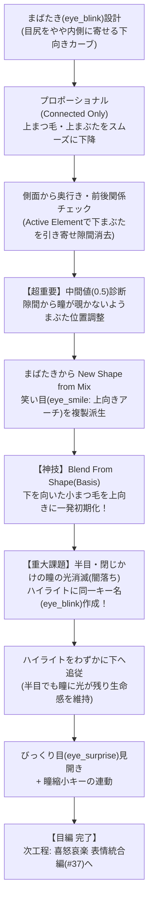

# ふさこ氏 キャラモデリング講座 #36 技術仕様書
## 【シェイプキー編02】まばたき・笑顔・目線のシェイプキー (Blender 3D)

- **元動画**: [【Blender】キャラクターモデル制作！シェイプキー編02 まばたき/笑い目/目線のシェイプキー【3Dモデリング講座】](https://www.youtube.com/watch?v=3oTySLvG9L8)（動画ID: `3oTySLvG9L8`）
- **対象工程**: まばたき（Eye Blink）の立体的引き下げと前後関係・隙間調整（Active Elementピボット）、中間値（0.5）における隙間・瞳漏れ防止策、New Shape from Mixによる笑い目（Eye Smile / にっこり目）のアーチ形成、下向きまつ毛のリセット技法（Blend From Shape）、まばたき時の「光消滅（闇落ち）防止」ハイライト下方追従連動キー、びっくり目（Eye Surprise）と瞳縮小（Pupil Shrink）の連動設計。
- **スクリーンショット一覧**: [docs/fusako_36_shapekey_eyes_screenshots/README.md](../../docs/fusako_36_shapekey_eyes_screenshots/README.md)

---

## 🎯 核心ワークフローサマリ

---

## 🛠️ 詳細手順仕様

### フェーズ1: まばたき（Eye Blink）の基本造形と前後関係の調整

1. **まばたきの変形カーブ設計**:
   - 上まつ毛・上まぶたを真下に落とすだけでなく、目尻側をやや内側に寄せる「緩やかな下向きカーブ」の軌跡で閉じるように設計する。
   - [📸 参考: fusako36_01_blender_eye_blink_planning_curve.jpg](../../docs/fusako_36_shapekey_eyes_screenshots/fusako36_01_blender_eye_blink_planning_curve.jpg)
2. **プロポーショナル編集によるまつ毛の引き下げ**:
   - `O` キーでプロポーショナル編集をONにし、影響範囲を **`Connected Only`（接続部のみ）** に限定。
   - まつ毛の太いメインパーツを選択し、下まぶたの位置までグイッとスムーズに引き下げる。
   - [📸 参考: fusako36_02_blender_proportional_connected_lash_down.jpg](../../docs/fusako_36_shapekey_eyes_screenshots/fusako36_02_blender_proportional_connected_lash_down.jpg)
3. **側面視点からの奥行き・前後関係の点検**:
   - 正面から下げた後、必ず側面（Side View）に視点を切り替える。
   - 顔面の球体カーブに沿って、まつ毛が肌の奥にめり込んだり浮きすぎたりしていないかを確認。
   - [📸 参考: fusako36_03_blender_lash_front_depth_check.jpg](../../docs/fusako_36_shapekey_eyes_screenshots/fusako36_03_blender_lash_front_depth_check.jpg)
4. **上下まぶたの前後ギャップ問題**:
   - 開眼時は上まぶたが下まぶたより前方に突出しているため、単純に垂直に下ろすと上下のまぶたの間に不自然な前後方向の隙間（段差）が開いてしまう。
   - [📸 参考: fusako36_04_blender_eyelid_gap_depth_issue.jpg](../../docs/fusako_36_shapekey_eyes_screenshots/fusako36_04_blender_eyelid_gap_depth_issue.jpg)
5. **Active Elementピボットによる隙間の埋め合わせ**:
   - ピボットポイントを **`Active Element`**（アクティブ要素）に変更。
   - まぶたの頂点を選択し、`S` キーで前方へ引き寄せることで、上下まぶたの接触面をピタリと密着させる。
   - [📸 参考: fusako36_05_blender_active_element_close_eyelid_gap.jpg](../../docs/fusako_36_shapekey_eyes_screenshots/fusako36_05_blender_active_element_close_eyelid_gap.jpg)
6. **G Y による皮膚表面への整流**:
   - 肌メッシュに埋まり込んでいる部分の頂点を、`G Y`（法線手前方向）で微小に引き出し、段差のない滑らかな皮膚表面を形成。
   - [📸 参考: fusako36_06_blender_gy_tweak_surface_alignment.jpg](../../docs/fusako_36_shapekey_eyes_screenshots/fusako36_06_blender_gy_tweak_surface_alignment.jpg)
7. **まつ毛端の折り返し処理**:
   - 目尻の鋭角な先端が飛び出さないよう、まつ毛端を内側に小さく折り返して皮膚のくぼみに自然に収める。
   - [📸 参考: fusako36_07_blender_lash_corner_fold_technique.jpg](../../docs/fusako_36_shapekey_eyes_screenshots/fusako36_07_blender_lash_corner_fold_technique.jpg)

---

### フェーズ2: まばたきの中間値チェックと瞳漏れの修正

1. **スライダー動作テスト**:
   - オブジェクトモードに戻り、シェイプキーの Value を `0.0` から `1.0` へゆっくりスライドさせてアニメーション動作を確認。
   - [📸 参考: fusako36_08_blender_blink_slider_value_check.jpg](../../docs/fusako_36_shapekey_eyes_screenshots/fusako36_08_blender_blink_slider_value_check.jpg)
2. **全方位からの穴あき・貫通診断**:
   - Value=1.0（全閉）の状態でカメラを斜め下、真横、斜め上から回転させ、内部のアイホールソケットや眼球が覗く穴が開いていないかを徹底点検。
   - [📸 参考: fusako36_09_blender_closed_eye_all_angles_audit.jpg](../../docs/fusako_36_shapekey_eyes_screenshots/fusako36_09_blender_closed_eye_all_angles_audit.jpg)
3. **下向きまつ毛の角度調整**:
   - まつ毛メッシュを少し回転させ、目を閉じた時にまつ毛が自然に下を向く角度（伏し目のニュアンス）を付与。
   - [📸 参考: fusako36_10_blender_lash_angle_downward_tilt.jpg](../../docs/fusako_36_shapekey_eyes_screenshots/fusako36_10_blender_lash_angle_downward_tilt.jpg)
4. **正面からの水平化（悪目立ち防止）**:
   - 正面視点（Front View）から見た際、まつ毛の板ポリが地面とほぼ水平（真横）になるように角度を微調整することで、正面から見た時にまつ毛の厚みが悪目立ちするのを防ぐ。
   - [📸 参考: fusako36_11_blender_lash_horizontal_blend_front.jpg](../../docs/fusako_36_shapekey_eyes_screenshots/fusako36_11_blender_lash_horizontal_blend_front.jpg)
5. **二重線の引き下げ連動**:
   - まぶたの開閉に合わせて、上部の二重線（アイラインメッシュ）も下方に移動させ、自然な皮膚のたるみを表現。
   - [📸 参考: fusako36_12_blender_double_eyelid_crease_down.jpg](../../docs/fusako_36_shapekey_eyes_screenshots/fusako36_12_blender_double_eyelid_crease_down.jpg)
6. **【超重要】中間値（0.5）での瞳漏れ欠陥の修正**:
   - **問題点**: Value=0.5付近で、上まぶたとまつ毛の隙間から眼球の虹彩（瞳）が一瞬チラリと覗いてしまう現象が発生。
   - **対策**: まぶたのラインをほんの少しさらに下方に引き下げ、下降ストロークの全区間で瞳を完全に覆い隠すように形状を修正。
   - [📸 参考: fusako36_13_blender_intermediate_pupil_leak_fix.jpg](../../docs/fusako_36_shapekey_eyes_screenshots/fusako36_13_blender_intermediate_pupil_leak_fix.jpg)

---

### フェーズ3: 笑い目（Eye Smile / にっこり目）の派生作成

1. **New Shape from Mix による複製**:
   - まばたき（`eye_blink`）のValueを `1.0` にした状態で、下矢印メニューから **`New Shape from Mix`** を実行。
   - 新規キーの名前を **`eye_smile`** に変更。
   - [📸 参考: fusako36_14_blender_new_shape_from_mix_eye_smile.jpg](../../docs/fusako_36_shapekey_eyes_screenshots/fusako36_14_blender_new_shape_from_mix_eye_smile.jpg)
2. **Shift + H による単独表示と上向きアーチ変形**:
   - 眉や髪など周囲のメッシュを `Shift + H` で非表示化。
   - まつ毛の中央を持ち上げ、下向きカーブから **上向きカーブ（緩やかな三日月型アーチ）** へ変形。
   - [📸 参考: fusako36_15_blender_shift_h_isolate_upward_curve.jpg](../../docs/fusako_36_shapekey_eyes_screenshots/fusako36_15_blender_shift_h_isolate_upward_curve.jpg)
3. **まつ毛太さの拡大（S Z）**:
   - にっこり笑顔の可愛らしさを強調するため、`S Z` でまつ毛の縦幅を少し太く拡大し、メリハリをつける。
   - [📸 参考: fusako36_16_blender_lash_sz_scale_charming_arch.jpg](../../docs/fusako_36_shapekey_eyes_screenshots/fusako36_16_blender_lash_sz_scale_charming_arch.jpg)
4. **【神技】Blend From Shape による小まつ毛のリセット**:
   - まばたきキーから派生したため、枝分かれした小さなまつ毛が下を向いたままになっている。
   - 小まつ毛の頂点を選択し、`Vertex` $\to$ **`Blend From Shape`** を実行。
   - Shape: `Basis` を指定して適用することで、**小まつ毛だけが一瞬で初期の上向き形状にリセットされる**！そこから笑顔の位置に再配置。
   - [📸 参考: fusako36_17_blender_blend_from_shape_basis_reset.jpg](../../docs/fusako_36_shapekey_eyes_screenshots/fusako36_17_blender_blend_from_shape_basis_reset.jpg)
5. **二重線のにっこり追従と完成**:
   - 笑い目の広がったアーチに合わせて二重線の横幅も拡大。原画通りの魅力的なにっこり笑顔が完成。
   - [📸 参考: fusako36_18_blender_double_eyelid_widen_smile.jpg](../../docs/fusako_36_shapekey_eyes_screenshots/fusako36_18_blender_double_eyelid_widen_smile.jpg)

---

### フェーズ4: ハイライト連動とびっくり目（Surprise）の作成

1. **半目・まばたき時の「光消滅（闇落ち）」重大問題**:
   - 目をゆっくり閉じるアニメーション時、上まぶたが下がることで瞳の白い丸ハイライトが真っ先に隠れ、**途中で目が死んだ（光のない絶望・闇落ちした）ような不気味な表情になってしまう**。
   - [📸 参考: fusako36_19_blender_blink_highlight_vanish_problem.jpg](../../docs/fusako_36_shapekey_eyes_screenshots/fusako36_19_blender_blink_highlight_vanish_problem.jpg)
2. **【神技】ハイライトメッシュへの同一キー連動**:
   - ハイライトオブジェクトを選択し、顔と同じ **`eye_blink`** という名前のシェイプキーを新規作成。
   - まばたきに合わせて、ハイライトを少しだけ下方に引き下げる。
   - [📸 参考: fusako36_20_blender_highlight_sync_eye_blink_key.jpg](../../docs/fusako_36_shapekey_eyes_screenshots/fusako36_20_blender_highlight_sync_eye_blink_key.jpg)
3. **生き生きとした半目の実現**:
   - Mio3 Shapekeyによって顔とハイライトが完全同期。
   - まばたき途中や眠そうな半目の状態でも、瞳のハイライトが最後まで輝きを放ち、アニメ特有の生命感が維持される！
   - [📸 参考: fusako36_21_blender_alive_eyes_half_closed_glow.jpg](../../docs/fusako_36_shapekey_eyes_screenshots/fusako36_21_blender_alive_eyes_half_closed_glow.jpg)
4. **`eye_surprise`（見開き目）の作成**:
   - 新規シェイプキー `eye_surprise` を作成。
   - 上まぶたをプロポーショナル編集で上方にやんわり引き上げ、大きく見開いた目を作成。
   - [📸 参考: fusako36_22_blender_eye_surprise_eyelids_wide_open.jpg](../../docs/fusako_36_shapekey_eyes_screenshots/fusako36_22_blender_eye_surprise_eyelids_wide_open.jpg)
5. **瞳縮小キーの連動**:
   - 瞳メッシュを `Ctrl + J` で統合し、同一名 `eye_surprise` を作成。
   - ピボットを Active Element にし、瞳のスケール（`S`）を少し小さく縮小。
   - 見開いた白目の中に小さな瞳が浮かぶ、漫画的なショック・驚愕の表情が完成。
   - [📸 参考: fusako36_23_blender_pupil_shrink_surprise_effect.jpg](../../docs/fusako_36_shapekey_eyes_screenshots/fusako36_23_blender_pupil_shrink_surprise_effect.jpg)
6. **目編完結とミラー左右分離の方針確認**:
   - まばたき、笑い目、びっくり目、ハイライト連動がすべて完成。
   - 現段階では左右対称ミラーで効率作成し、後工程でミラー適用後に左右分離（ウィンク用）を行う方針を確認。
   - [📸 参考: fusako36_24_blender_eye_shapekeys_done_mirror_note.jpg](../../docs/fusako_36_shapekey_eyes_screenshots/fusako36_24_blender_eye_shapekeys_done_mirror_note.jpg)

---

## 💡 プロ直伝Tips & ノウハウまとめ

1. **半目ハイライト連動（最重要セルルック技術）**:
   - リアルなCGでは光源によってハイライトが決まるが、アニメモデルのハイライトは「メッシュ」で描かれている。
   - まばたき時にハイライトが固定されていると、まぶたに切られて急激に光が消滅する。ハイライト自体をシェイプキーで少し下げてまぶたから逃がすテクニックは、VTuberやアニメゲームモデル制作における超定番の必須技。
2. **Blend From Shape（Basis）の部分リセット技**:
   - 「New Shape from Mix」で派生させた後、「一部のパーツだけ元の初期形状に戻したい」というケースが頻発する。
   - 戻したい頂点だけを選択して `Blend From Shape`（Basis）をかけるだけで、他の変形を一切崩さずに部分リセットできる。モデリング効率を飛躍的に高める技。
3. **中間値（0.5）の厳密検証**:
   - シェイプキーの変形は「直線補間」であるため、球体に近い眼球の表面に沿って円弧状に移動させたいまぶたは、中間地点で必ず眼球に食い込むか隙間が開く。
   - スライダーを0.5にして中間形状を微調整することが、綺麗なまばたきモーションを作る唯一の秘訣。
