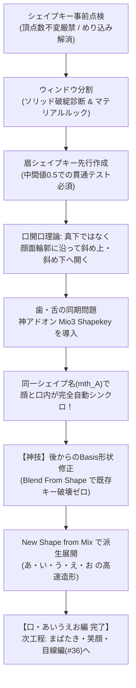

# ふさこ氏 キャラモデリング講座 #35 技術仕様書
## 【シェイプキー編01】あいうえお口の形のシェイプキー (Blender 3D)

- **元動画**: [【Blender】キャラクターモデル制作！シェイプキー編01 口のシェイプキー【3Dモデリング講座】](https://www.youtube.com/watch?v=A6vy0tfvAzA)（動画ID: `A6vy0tfvAzA`）
- **対象工程**: シェイプキー作成前の鉄則・準備（頂点数変更厳禁・ウィンドウ分割・VRoid命名規則リファレンス）、眉毛シェイプキー先行作成（中間値貫通テスト）、アニメ調口開口の黄金則（斜め開口・エッジスライド）、神アドオン `Mio3 Shapekey` による別オブジェクト（顔・歯・舌）の完全自動同期連動、シェイプキー作成後の「デフォルト形状（Basis）修正」神技法（Blend From Shape）、New Shape from Mixを活用したリップシンク対応「あ・い・う・え・お」口の高速モデリング。
- **スクリーンショット一覧**: [docs/fusako_35_shapekey_mouth_screenshots/README.md](../../docs/fusako_35_shapekey_mouth_screenshots/README.md)

---

## 🎯 核心ワークフローサマリ

---

## 🛠️ 詳細手順仕様

### フェーズ1: シェイプキー作成前の鉄則・準備と環境構築

1. **シェイプキー全体設計と必要表情の整理**:
   - キャラクターモデルに必要な最低限のシェイプキー:
     - ① 喜怒哀楽（眉・目・口の組み合わせ）
     - ② リップシンク用口形状（あ・い・う・え・お）
     - ③ まばたき（通常まばたき、にっこり目、目線追従）
   - [📸 参考: fusako35_01_blender_shapekey_overview_vroid.jpg](../../docs/fusako_35_shapekey_mouth_screenshots/fusako35_01_blender_shapekey_overview_vroid.jpg)
2. **【最重要鉄則】頂点数の増減厳禁とBasis点検**:
   - **シェイプキーを作成した後にメッシュの頂点数を増減（押し出し・細分化・溶解・削除等）させると、シェイプキーの頂点インデックスが狂い、データが不可逆的に破壊される**。
   - 作成前に、まつ毛のめり込みや口の隙間など、初期状態（Basis）に気になる点がないか徹底点検して修正しておくこと。
   - [📸 参考: fusako35_02_blender_vertex_count_freeze_basis_check.jpg](../../docs/fusako_35_shapekey_mouth_screenshots/fusako35_02_blender_vertex_count_freeze_basis_check.jpg)
3. **ウィンドウ分割による二重監視環境**:
   - 画面を左右に分割:
     - 左画面: ソリッドビュー（ワイヤーフレームやポリゴンの交差・めり込み破綻を厳密にチェック）
     - 右画面: マテリアル/レンダープレビュー（セル画としての最終ルック・可愛さを確認）
   - [📸 参考: fusako35_03_blender_split_window_solid_rendered.jpg](../../docs/fusako_35_shapekey_mouth_screenshots/fusako35_03_blender_split_window_solid_rendered.jpg)
4. **VRoidモデルリファレンスと命名規則**:
   - VRoid Studioから出力したVRMモデルを `VRM Add-on for Blender` でインポートし、表情一覧や標準的な命名規則（`brow_joy`, `brow_angry`, `mth_A`, `mth_I` 等）を参照。VRM/Unity連携時の互換性を担保する。
   - [📸 参考: fusako35_04_blender_vroid_vrm_reference_shapekeys.jpg](../../docs/fusako_35_shapekey_mouth_screenshots/fusako35_04_blender_vroid_vrm_reference_shapekeys.jpg)

---

### フェーズ2: 眉毛の表情シェイプキー先行作成

1. **モディファイア適用前のトポロジーで作成**:
   - Subsurf（細分化）やMirror（ミラー）は適用せず、頂点数が少なく動かしやすいローポリの状態でシェイプキーを作成する。
   - [📸 参考: fusako35_05_blender_brow_pre_subsurf_workflow.jpg](../../docs/fusako_35_shapekey_mouth_screenshots/fusako35_05_blender_brow_pre_subsurf_workflow.jpg)
2. **Basisと新規キー追加**:
   - オブジェクトデータプロパティの「Shape Keys」パネルで `+` を押し、基準形状 `Basis` を作成。
   - 再度 `+` を押して新規シェイプキーを追加し、編集モードで頂点を動かす。
   - [📸 参考: fusako35_06_blender_add_basis_new_shapekey.jpg](../../docs/fusako_35_shapekey_mouth_screenshots/fusako35_06_blender_add_basis_new_shapekey.jpg)
3. **`brow_angry`（怒り眉）と顔面めり込み防止**:
   - 眉頭を斜め下に引き下げて怒り眉を作成。
   - **注意点**: 顔面の曲面に沿って動かさないと眉が皮膚の中に埋もれてしまうため、わずかに法線方向・手前（`G Y` 等）に引き出して配置する。
   - [📸 参考: fusako35_07_blender_brow_angry_offset_penetration.jpg](../../docs/fusako_35_shapekey_mouth_screenshots/fusako35_07_blender_brow_angry_offset_penetration.jpg)
4. **【超重要】中間値（0.5）での貫通テスト**:
   - シェイプキーは頂点が「直線補間」で移動するため、Value=0とValue=1では問題なくても、**Value=0.5の中間地点で顔面を突き抜けて埋没する現象が頻発する**。
   - スライダーをゆっくりドラッグし、移動軌跡の全域で貫通しないことを必ず目視検証する。
   - [📸 参考: fusako35_08_blender_intermediate_value_penetration_test.jpg](../../docs/fusako_35_shapekey_mouth_screenshots/fusako35_08_blender_intermediate_value_penetration_test.jpg)
5. **喜怒哀楽・驚き眉の作成**:
   - `brow_sorrow`（困り・ハの字）、`brow_fun`（にっこり下げ）、`brow_surprise`（上方向への大きな引き上げ）を作成。
   - [📸 参考: fusako35_09_blender_brow_sorrow_sad_down.jpg](../../docs/fusako_35_shapekey_mouth_screenshots/fusako35_09_blender_brow_sorrow_sad_down.jpg)
   - [📸 参考: fusako35_10_blender_brow_surprise_upward.jpg](../../docs/fusako_35_shapekey_mouth_screenshots/fusako35_10_blender_brow_surprise_upward.jpg)

---

### フェーズ3: 「あ」の口の造形と神アドオン `Mio3 Shapekey` 連動

1. **アニメ調口開口の黄金則**:
   - 口を開く際、リアルな解剖学のように「顎を真下に下げる」と、アニメ顔では輪郭が崩れ非常に不格好になる。
   - **頬や顎の輪郭カーブに沿って「斜め上・斜め下」に放射状に開く**ことで、可愛いセル調の開口を維持できる。
   - [📸 参考: fusako35_11_blender_mouth_diagonal_open_principle.jpg](../../docs/fusako_35_shapekey_mouth_screenshots/fusako35_11_blender_mouth_diagonal_open_principle.jpg)
2. **エッジスライド（G G）による開口**:
   - 唇のエッジループを選択し、`G G`（Edge Slide）で外側・上下へ滑らせて開口形状（`mth_A`）を作る。
   - [📸 参考: fusako35_12_blender_gg_edge_slide_mouth_open.jpg](../../docs/fusako_35_shapekey_mouth_screenshots/fusako35_12_blender_gg_edge_slide_mouth_open.jpg)
3. **口内・歯オブジェクトのシェイプキー作成**:
   - 歯・舌オブジェクト側にもBasisと新規キーを作成。
   - 上の歯を上へ隠し、下の歯・舌を斜め下へ下げて開口時の配置にする。
   - [📸 参考: fusako35_13_blender_teeth_tongue_shapekey_mouth_a.jpg](../../docs/fusako_35_shapekey_mouth_screenshots/fusako35_13_blender_teeth_tongue_shapekey_mouth_a.jpg)
4. **別オブジェクト非同期の課題**:
   - 顔メッシュと歯メッシュが別オブジェクトの場合、通常はそれぞれ個別にスライダーを動かさなければならず、確認やアニメーション付けが困難。
   - [📸 参考: fusako35_14_blender_separate_objects_sync_problem.jpg](../../docs/fusako_35_shapekey_mouth_screenshots/fusako35_14_blender_separate_objects_sync_problem.jpg)
5. **神アドオン `Mio3 Shapekey` の導入・設定**:
   - 顔オブジェクトを選択し、オブジェクトプロパティ内の「Mio3 Shapekey」パネルを開く。
   - 同期させたいコレクション（例: `Head.001`）を指定する。
   - [📸 参考: fusako35_15_blender_mio3_shapekey_addon_setup.jpg](../../docs/fusako_35_shapekey_mouth_screenshots/fusako35_15_blender_mio3_shapekey_addon_setup.jpg)
6. **同一キー名による完全自動同期**:
   - 顔と歯の両方のシェイプキー名を **`mth_A`** に完全一致させる。
   - **結果**: 顔の `mth_A` スライダーを動かすだけで、歯・口内オブジェクトも**ミリ秒の狂いもなく完全自動連動**してパクパク開閉する！
   - [📸 参考: fusako35_16_blender_mth_a_auto_sync_face_teeth.jpg](../../docs/fusako_35_shapekey_mouth_screenshots/fusako35_16_blender_mth_a_auto_sync_face_teeth.jpg)

---

### フェーズ4: シェイプキー作成後の「デフォルト形状（Basis）修正」神技法

口を開けてみたところ、内部の口腔ソケットが小さすぎて歯がめり込んでいることに気づいた場合の安全な後修正ワークフロー。

1. **修正用シェイプキーの作成**:
   - `+` ボタンで一時的な修正用シェイプキー（`temp_fix`）を新規作成。
   - [📸 参考: fusako35_17_blender_basis_fix_workflow_socket.jpg](../../docs/fusako_35_shapekey_mouth_screenshots/fusako35_17_blender_basis_fix_workflow_socket.jpg)
2. **口腔内の一括選択と拡張**:
   - 唇内側のエッジループを選択し、`Select` $\to$ `Select Loops` $\to$ **`Select Loop Inner-Region`** で口腔奥を一発全選択。
   - **`Alt + S`（法線膨張）** や `S` で口腔ソケットを大きく拡張する。
   - [📸 参考: fusako35_18_blender_select_loop_inner_region_alt_s.jpg](../../docs/fusako_35_shapekey_mouth_screenshots/fusako35_18_blender_select_loop_inner_region_alt_s.jpg)
3. **Vertex -> Blend From Shape によるBasisへの統合**:
   - シェイプキーを `Basis` に戻し、修正したい口腔奥の頂点を選択。
   - ヘッダーの `Vertex` $\to$ **`Blend From Shape`（シェイプからブレンド）** を実行。
   - プロパティで Shape: `temp_fix`, Blend: `1.0` を指定して適用。
   - `temp_fix` キーを削除（`-`）。
   - **結果**: 既存の `mth_A` キーを一切壊すことなく、大元のBasisの口腔サイズだけが綺麗に修正反映される！
   - [📸 参考: fusako35_19_blender_vertex_blend_from_shape_basis.jpg](../../docs/fusako_35_shapekey_mouth_screenshots/fusako35_19_blender_vertex_blend_from_shape_basis.jpg)

---

### フェーズ5: New Shape from Mix による「い・う・え・お」の派生作成

1. **New Shape from Mix のワークフロー**:
   - `mth_A` のValueを半分程度（0.4〜0.5）開けた状態にする。
   - シェイプキーパネルの「下矢印アイコン」をクリック $\to$ **`New Shape from Mix`（ミックスから新規シェイプ）** を実行。
   - 開いた状態がベイクされた新しい独立シェイプキーが生成される。
   - [📸 参考: fusako35_20_blender_new_shape_from_mix_workflow.jpg](../../docs/fusako_35_shapekey_mouth_screenshots/fusako35_20_blender_new_shape_from_mix_workflow.jpg)
2. **「い」(`mth_I`) の造形**:
   - 口角を左右に引っ張り、横長の平たい形状にする。上の歯が水平に綺麗に見えるように調整。
   - [📸 参考: fusako35_21_blender_mth_i_horizontal_spread_teeth.jpg](../../docs/fusako_35_shapekey_mouth_screenshots/fusako35_21_blender_mth_i_horizontal_spread_teeth.jpg)
3. **「う」(`mth_U`) の造形とActive Elementピボット**:
   - ピボットポイントを **`Active Element`** に変更。
   - 唇外周を選択して `S` キーで内側へすぼめる。おちょぼ口・小さな円形開口を形成。
   - [📸 参考: fusako35_22_blender_mth_u_active_element_pucker.jpg](../../docs/fusako_35_shapekey_mouth_screenshots/fusako35_22_blender_mth_u_active_element_pucker.jpg)
4. **「え」(`mth_E`) の造形とピン留めプレビュー**:
   - 「あ」と「い」の中間的な開き口を作成。
   - パネル上部の「ピン留めアイコン」を押すと、選択中のキーが強制的にValue=1で表示されるため、キーボードの上下矢印キーでキーを切り替えてパラパラ漫画のように開口変化を点検できる。
   - [📸 参考: fusako35_23_blender_mth_e_pin_preview_toggle.jpg](../../docs/fusako_35_shapekey_mouth_screenshots/fusako35_23_blender_mth_e_pin_preview_toggle.jpg)
5. **「お」(`mth_O`) の造形と完成**:
   - 「う」よりも縦長で丸みのあるオーバル（楕円）形状を作成。
   - これにてリップシンク対応の「あ・い・う・え・お」5母音口シェイプキーが完全完成！
   - [📸 参考: fusako35_24_blender_mth_o_vertical_oval_aiueo_done.jpg](../../docs/fusako_35_shapekey_mouth_screenshots/fusako35_24_blender_mth_o_vertical_oval_aiueo_done.jpg)

---

## 💡 プロ直伝Tips & ノウハウまとめ

1. **Mio3 Shapekey アドオンはキャラ制作の必須インフラ**:
   - 顔本体、歯、舌、瞳、ハイライトなど、パーツが分かれているモデルにおいて、同一キー名にするだけで同期してくれるこのアドオンは、リップシンクや表情作成の作業効率を数倍に引き上げる。
2. **Blend From Shape による「後出しBasis修正」**:
   - 初心者が最も恐れる「シェイプキー作成後にベース形状の不具合に気づいた」トラブルを、既存キーを一切壊さずに解決できる最高峰のリカバリー技。
3. **New Shape from Mix の連鎖**:
   - ゼロから毎回口の形を作るのではなく、最も開いた「あ」から「い」「う」「え」「お」を部分ブレンドして派生させることで、開閉ストロークの整合性が保たれ、アニメーションさせた時に破綻しない。
