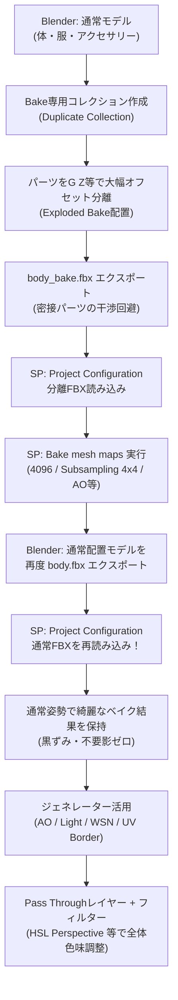

# ふさこ氏 キャラモデリング講座 #31 技術仕様書
## 【テクスチャ編04】ベイク方法とジェネレーター・フィルター (Substance 3D Painter)

- **元動画**: [【Blender】キャラクターモデル制作！テクスチャ編04 ベイク方法とジェネレーター・フィルター【3Dモデリング講座】](https://www.youtube.com/watch?v=QY0WSefAyKM)（動画ID: `QY0WSefAyKM`）
- **対象工程**: 体・服・アクセサリーのベイク準備（Blenderでの分離配置 / Exploded Bake）、Substance Painterでのメッシュマップベイク、形状復元（Project Configuration）、イラスト調で使える主要ジェネレーター（AO, Light, World Space Normal, UV Border, Auto Stitch, Curvature）の実践、後処理フィルターとPass Throughブレンドモードによる全体カラーグレーディング。
- **スクリーンショット一覧**: [docs/fusako_31_sp_bake_generators_screenshots/README.md](../../docs/fusako_31_sp_bake_generators_screenshots/README.md)

---

## 🎯 核心ワークフローサマリ

---

## 🛠️ 詳細手順仕様

### フェーズ1: ベイクの落とし穴とBlenderでのパーツ分離（Exploded Bake）

密接したパーツ（体・服・アウター・ポシェット・尻尾など）をそのままベイクすると、AO（アンビエントオクルージョン）計算により接触境界が真っ黒になり、さらに左右対称UV（重ねUV）の反対側にも不自然な影が焼き付いてしまう。これをBlender側のコレクション複製とオフセット移動で根本解決する。

1. **初回エクスポートと問題の把握**:
   - Blenderで髪・顔コレクションを非表示にし、体・服・アクセサリーのメッシュのみ全選択（`A`）。
   - `F4` $\to$ Export $\to$ FBX（「Selected Objects」にチェック、「Mesh」のみON）。`body.fbx` としてエクスポート。
   - [📸 参考: fusako31_01_blender_export_body_initial.jpg](../../docs/fusako_31_sp_bake_generators_screenshots/fusako31_01_blender_export_body_initial.jpg)
2. **Substance Painterでの初回読み込みとベイク欠陥の確認**:
   - SPで `File` $\to$ `New` から `body.fbx` を読み込み。
   - [📸 参考: fusako31_02_sp_import_initial_model.jpg](../../docs/fusako_31_sp_bake_generators_screenshots/fusako31_02_sp_import_initial_model.jpg)
   - メッシュマップベイクを実行してAO表示を確認すると、ポシェットとアウターの接触面など、近接部分が真っ黒に沈んでしまう。
   - [📸 参考: fusako31_03_sp_ao_black_artifact_issue.jpg](../../docs/fusako_31_sp_bake_generators_screenshots/fusako31_03_sp_ao_black_artifact_issue.jpg)
   - 斜めがけ肩紐の影が、UVを左右対称で重ねているために、肩紐がない側の体表面にも影として焼き付いてしまう。
   - [📸 参考: fusako31_04_sp_symmetry_shadow_bleeding.jpg](../../docs/fusako_31_sp_bake_generators_screenshots/fusako31_04_sp_symmetry_shadow_bleeding.jpg)
3. **Blenderでのコレクション退避複製**:
   - 位置をずらした後に正確に元に戻せるよう、アウトライナーで「ACC」や「Body」コレクションを右クリック $\to$ `Duplicate Collection` で複製。
   - [📸 参考: fusako31_05_blender_duplicate_collection.jpg](../../docs/fusako_31_sp_bake_generators_screenshots/fusako31_05_blender_duplicate_collection.jpg)
4. **Bake専用コレクションの階層構築**:
   - 新規コレクション `Bake` を作成し、複製したパーツ群をその中に移動。
   - テンキー/数字キー `2` 等でBakeコレクションのみを単独表示にし、元のコレクションは安全に非表示化。
   - [📸 参考: fusako31_06_blender_setup_bake_collection.jpg](../../docs/fusako_31_sp_bake_generators_screenshots/fusako31_06_blender_setup_bake_collection.jpg)
5. **G Zによるパーツの大幅オフセット移動**:
   - アクセサリーフォルダを右クリック $\to$ `Select Objects` で全選択し、`G Z` で上方に大きく引き離す。
   - [📸 参考: fusako31_07_blender_offset_gz_accessories.jpg](../../docs/fusako_31_sp_bake_generators_screenshots/fusako31_07_blender_offset_gz_accessories.jpg)
6. **干渉パーツ（アウター・尻尾）のクリアランス確保**:
   - アウターや尻尾など、相互に影が落ちる近接パーツをそれぞれ上下・前後に大きく離す。
   - [📸 参考: fusako31_08_blender_separate_outer_and_tail.jpg](../../docs/fusako_31_sp_bake_generators_screenshots/fusako31_08_blender_separate_outer_and_tail.jpg)
7. **ミラーモディファイアの原点維持**:
   - 左右対称パーツを横に動かす場合、中心軸がずれないようにモディファイアの `Mirror Object` に中央の基準メッシュを指定して対称性を維持。
   - [📸 参考: fusako31_09_blender_mirror_object_reference.jpg](../../docs/fusako_31_sp_bake_generators_screenshots/fusako31_09_blender_mirror_object_reference.jpg)
8. **Exploded Bake配置の完成とエクスポート**:
   - 全パーツが完全に干渉しない「爆発図（Exploded View）」状態が完成したら、全選択して `F4` $\to$ FBXエクスポート（`body.fbx` に上書き）。
   - [📸 参考: fusako31_10_blender_exploded_bake_layout_done.jpg](../../docs/fusako_31_sp_bake_generators_screenshots/fusako31_10_blender_exploded_bake_layout_done.jpg)

---

### フェーズ2: SPでのベイク実行と通常モデルの再リンク

1. **Project Configurationによる分離FBXの再読み込み**:
   - Substance Painterに戻り、`Edit` $\to$ `Project Configuration` を開く。
   - File「Select」から先ほどエクスポートした分離版 `body.fbx` を指定してOK。モデルが分離配置に差し替わる。
   - [📸 参考: fusako31_11_sp_project_config_reload_exploded.jpg](../../docs/fusako_31_sp_bake_generators_screenshots/fusako31_11_sp_project_config_reload_exploded.jpg)
2. **メッシュマップのベイク実行**:
   - テクスチャセットセッティング下の `Bake mesh maps` を開いてベイクを実行。
   - ポシェット周囲の不要な黒い影や、左右対称の影被りが完全に消え去った綺麗なAOマップが生成される。
   - [📸 参考: fusako31_12_sp_bake_mesh_maps_clean_ao.jpg](../../docs/fusako_31_sp_bake_generators_screenshots/fusako31_12_sp_bake_mesh_maps_clean_ao.jpg)
3. **Bキーによるマップ診断**:
   - `B` キーを押すごとにビューポートの表示マップが順次切り替わる（AO $\to$ Curvature $\to$ World Space Normal $\to$ Position等）。
   - 特に `World Space Normal` はUVの反転・重なりやメッシュの裏返りを視覚的にチェックするのに極めて有用。
   - [📸 参考: fusako31_13_sp_b_key_world_space_normal_check.jpg](../../docs/fusako_31_sp_bake_generators_screenshots/fusako31_13_sp_b_key_world_space_normal_check.jpg)
4. **本番用高解像度ベイク設定**:
   - 軽量プレビュー（512）で問題がなければ、Output Sizeを `4096` に引き上げる。
   - [📸 参考: fusako31_14_sp_bake_settings_4096_resolution.jpg](../../docs/fusako_31_sp_bake_generators_screenshots/fusako31_14_sp_bake_settings_4096_resolution.jpg)
5. **アンチエイリアシングと不要マップの除外**:
   - Antialiasing の Subsampling を `4x4` に設定。
   - セルルック制作では使用しない `Normal` と `ID` のチェックを外し、ベイク時間の短縮とリソース節約を図る。
   - テクスチャセットごとに個別にベイクしたい場合は、左上の `Selection` から対象マテリアルのみチェックを入れる。
   - [📸 参考: fusako31_15_sp_antialiasing_subsampling_4x4.jpg](../../docs/fusako_31_sp_bake_generators_screenshots/fusako31_15_sp_antialiasing_subsampling_4x4.jpg)
6. **Blenderで通常配置モデルの再エクスポート**:
   - ベイク完了後、Blenderに戻り、元の正常な位置にあるコレクションを表示して全選択 $\to$ FBXエクスポート。
   - [📸 参考: fusako31_16_sp_bake_finished_blender_original.jpg](../../docs/fusako_31_sp_bake_generators_screenshots/fusako31_16_sp_bake_finished_blender_original.jpg)
7. **SPでの通常モデル復元（黄金テクニック）**:
   - SPの `Edit` $\to$ `Project Configuration` から、通常配置のFBXを再読み込み。
   - **結果**: 先ほど分離状態でベイクした高精細なAO・Curvatureマップを100%保持したまま、通常プロポーションのモデル上でペイント作業を継続可能！
   - [📸 参考: fusako31_17_sp_reload_original_keep_bake_maps.jpg](../../docs/fusako_31_sp_bake_generators_screenshots/fusako31_17_sp_reload_original_keep_bake_maps.jpg)

---

### フェーズ3: セルルック・イラスト調で使える主要ジェネレーター実践

1. **アウターのベースレイヤー作成**:
   - アウターのテクスチャセットを選択し、Base Color単一チャンネルのFill Layerを作成して水色の下地色を設定。
   - [📸 参考: fusako31_18_sp_outer_base_fill_layer.jpg](../../docs/fusako_31_sp_bake_generators_screenshots/fusako31_18_sp_outer_base_fill_layer.jpg)
2. **Ambient Occlusion（AO）ジェネレーター**:
   - 上層にやや暗い影色のFill Layerを追加し、黒マスク（Add black mask）を付与。
   - マスクを右クリック $\to$ `Add generator` $\to$ `Ambient Occlusion` を選択。
   - `Global Invert` を `True` に設定することで、窪みや溝部分に影色が乗る。
   - [📸 参考: fusako31_19_sp_generator_ao_global_invert.jpg](../../docs/fusako_31_sp_bake_generators_screenshots/fusako31_19_sp_generator_ao_global_invert.jpg)
3. **AOのコントラスト調整とUVシーム切れの注意点**:
   - `Global Balance` や `Global Contrast` で影の硬さを調整。
   - **【最重要注意点】**: SPのブラー（Blur）は3D空間ではなく2Dテクスチャ画像に対して処理されるため、値を上げすぎるとUVシーム（切れ目）の境界でボケが不自然に途切れてしまう。ブラーの多用は避け、コントラストで引き締めるのがコツ。
   - [📸 参考: fusako31_20_sp_ao_contrast_blur_seam_warning.jpg](../../docs/fusako_31_sp_bake_generators_screenshots/fusako31_20_sp_ao_contrast_blur_seam_warning.jpg)
4. **Light ジェネレーター（光源シミュレーション）**:
   - 明るい色のFill Layerに黒マスク + `Light` ジェネレーターを追加。
   - 光源の `Angle` や水平・垂直角を前面・上方に向ける。
   - レイヤーのブレンドモードを `Screen` 等にすることで、イラストでよく見られる「前照灯・環境光」のふんわりとした光感を簡単に再現。
   - [📸 参考: fusako31_21_sp_generator_light_screen_blend.jpg](../../docs/fusako_31_sp_bake_generators_screenshots/fusako31_21_sp_generator_light_screen_blend.jpg)
5. **World Space Normal ジェネレーター**:
   - 一定の方向を向いた面（法線）だけにマスクを通すジェネレーター。
   - パラメータの `Top to Bottom` や `Light to Left` を調整することで、上向きの面だけに光を当てたり、下向きの面に環境影を落とすことが可能。
   - [📸 参考: fusako31_22_sp_generator_world_space_normal.jpg](../../docs/fusako_31_sp_bake_generators_screenshots/fusako31_22_sp_generator_world_space_normal.jpg)
6. **UV Border & Auto Stitch ジェネレーター**:
   - **UV Border**: UVアイランドの外周（シーム境界）に沿って線を引く。服の縫い目や境界線のライン出しに有効。不要な箇所はペイントレイヤー（黒ブラシ）で消去。
   - **Auto Stitch**: UVの切れ目近傍に点線状の縫い目（ステッチ）を自動配置。
   - **Curvature（曲率）**: メッシュの尖った角・凸部（エッジ）を検出し、エッジハイライトや擦れ表現を付与。
   - [📸 参考: fusako31_23_sp_generator_uv_border_auto_stitch.jpg](../../docs/fusako_31_sp_bake_generators_screenshots/fusako31_23_sp_generator_uv_border_auto_stitch.jpg)

---

### フェーズ4: 後処理フィルターとPass Throughによる全体色味調整

1. **Pass ThroughブレンドモードとHSL Perspective**:
   - レイヤー階層の最上段に新規レイヤーを追加。
   - レイヤーのブレンドモードを `Normal` から **`Pass Through`（パススルー）** に変更（下層の全結果を透過して受け取る）。
   - レイヤーを右クリック $\to$ `Add filter` $\to$ **`HSL Perspective`** を適用。
   - `Saturation`（彩度）や `Hue`（色相）をスライダー操作することで、レイヤー全体の一括カラーグレーディングやトーン調整が可能。
   - その他、`Contrast` や `Gradient` フィルターも後処理の質感統一に極めて有効。
   - [📸 参考: fusako31_24_sp_filter_hsl_passthrough_grading.jpg](../../docs/fusako_31_sp_bake_generators_screenshots/fusako31_24_sp_filter_hsl_passthrough_grading.jpg)

---

## 💡 プロ直伝Tips & ノウハウまとめ

1. **Exploded Bake（分解ベイク）の威力**:
   - アニメ調・セルルック制作では、リアル系のように「全パーツのAO影をそのまま落とす」と黒ずみすぎて濁った印象になりがち。
   - Blenderのコレクション機能を活用し、Bake用配置と通常配置をFBXの再リンク（Project Configuration）で切り替える手法は、SPでのセルルック制作における最重要標準テクニック。
2. **2Dブラーのシーム境界割れ対策**:
   - ジェネレーター内のBlurスライダーはUV境界を跨げないため、境目でアーティファクトが発生する。
   - なだらかなグラデーションが必要な場合は、2Dブラーに頼るのではなく、**3D Distance** や **Position**、**World Space Normal** などの3D空間座標に基づくジェネレーターを使用するのが鉄則。
3. **Pass Throughレイヤーの原則**:
   - フィルターを「全体」にかけたい場合は、空レイヤーのブレンドモードを `Pass Through` にしないと効果が下層に反映されない。グレーディング専用の調整レイヤーとして運用すること。
