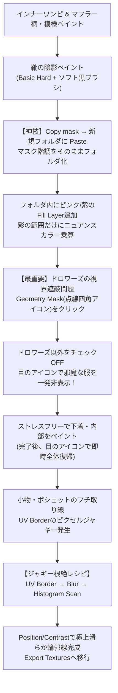

# ふさこ氏 キャラモデリング講座 #33 技術仕様書
## 【テクスチャ編06】服や小物のテクスチャ (Substance 3D Painter)

- **元動画**: [【Blender】キャラクターモデル制作！テクスチャ編06 服や小物のテクスチャ【3Dモデリング講座】](https://www.youtube.com/watch?v=MMP_BQJNKuc)（動画ID: `MMP_BQJNKuc`）
- **対象工程**: インナーワンピース・マフラーの柄ペイント、靴の陰影階調とマスクのフォルダ化・ニュアンスカラー乗算（Copy Mask / Paste into Mask）、ジオメトリマスク（Geometry Mask）を活用した内部メッシュ（ドロワーズ等）の単独表示・快適ペイント、小物・ポシェットのフチ線ジャギー根絶レシピ（UV Border ＋ Blur ＋ Histogram Scan）、全テクスチャセットのエクスポート準備。
- **スクリーンショット一覧**: [docs/fusako_33_sp_clothes_props_screenshots/README.md](../../docs/fusako_33_sp_clothes_props_screenshots/README.md)

---

## 🎯 核心ワークフローサマリ

---

## 🛠️ 詳細手順仕様

### フェーズ1: インナーワンピース・マフラーの柄ペイント

1. **インナーワンピの模様描き込み**:
   - ワンピースの胸元や裾のライン・幾何学模様を、資料に合わせてペイント。
   - [📸 参考: fusako33_01_sp_inner_dress_pattern_start.jpg](../../docs/fusako_33_sp_clothes_props_screenshots/fusako33_01_sp_inner_dress_pattern_start.jpg)
2. **マフラーの模様ストローク**:
   - 首元マフラーのチェック柄・編み目ストロークを、Symmetryを適宜活用して描画。
   - [📸 参考: fusako33_02_sp_muffler_pattern_strokes.jpg](../../docs/fusako_33_sp_clothes_props_screenshots/fusako33_02_sp_muffler_pattern_strokes.jpg)
3. **インナーワンピ・マフラー仕上がり確認**:
   - 全体の配色バランスと柄の均一性を確認し、次のパーツへ進行。
   - [📸 参考: fusako33_03_sp_inner_dress_muffler_done.jpg](../../docs/fusako_33_sp_clothes_props_screenshots/fusako33_03_sp_inner_dress_muffler_done.jpg)

---

### フェーズ2: 靴の陰影ペイントとマスクフォルダ化・ニュアンスカラー技法

1. **靴の陰影初期配置（ラフ塗り）**:
   - 硬めのブラシ（Basic Hard）を使用し、靴の甲やソールの立体的な落ち影ラインを配置。
   - [📸 参考: fusako33_04_sp_shoes_rough_shadow_pass.jpg](../../docs/fusako_33_sp_clothes_props_screenshots/fusako33_04_sp_shoes_rough_shadow_pass.jpg)
2. **ソフト黒ブラシによる境界の階調づくり**:
   - 上層にペイントレイヤーを追加し、柔らかい黒ブラシで影の境界をわずかにぼかして滑らかなグラデーションを付与。
   - [📸 参考: fusako33_05_sp_shoes_soft_brush_feathering.jpg](../../docs/fusako_33_sp_clothes_props_screenshots/fusako33_05_sp_shoes_soft_brush_feathering.jpg)
3. **【神技】影マスクのコピー（Copy mask）**:
   - **課題**: 影の範囲に、反射光や環境光としての「淡いピンクや紫のニュアンスカラー」を重ねたい。
   - **手順**: 先ほど作成した影レイヤーの黒マスクを右クリック $\to$ **`Copy mask`** を選択。
   - [📸 参考: fusako33_06_sp_copy_mask_from_shadow_layer.jpg](../../docs/fusako_33_sp_clothes_props_screenshots/fusako33_06_sp_copy_mask_from_shadow_layer.jpg)
4. **新規フォルダへのマスクペースト（Paste into mask）**:
   - レイヤー階層に新規フォルダを作成し、黒マスク（Add black mask）を追加。
   - フォルダのマスクを右クリック $\to$ **`Paste into mask`** を実行。影の複雑な形状とボケ階調がフォルダ全体にそのまま複製される！
   - [📸 参考: fusako33_07_sp_new_folder_paste_into_mask.jpg](../../docs/fusako_33_sp_clothes_props_screenshots/fusako33_07_sp_new_folder_paste_into_mask.jpg)
5. **階層整理と個別マスクの削除**:
   - 影のFill Layerをフォルダ内にドラッグして移動。
   - フォルダ側でマスクが効いているため、Fill Layer自身のマスクは右クリック $\to$ `Remove mask` で削除してシンプル化。
   - [📸 参考: fusako33_08_sp_folder_remove_individual_mask.jpg](../../docs/fusako_33_sp_clothes_props_screenshots/fusako33_08_sp_folder_remove_individual_mask.jpg)
6. **影領域限定のニュアンスカラー乗算**:
   - フォルダ内に新規Fill Layerを追加し、ピンクや紫系の淡い色を設定。
   - **結果**: 影の境界やグラデーションを崩すことなく、影の範囲内にだけ絶妙なアニメ調のニュアンスカラー（色気・透明感）を重ねることができる！
   - [📸 参考: fusako33_09_sp_folder_tint_shadow_subtle_color.jpg](../../docs/fusako_33_sp_clothes_props_screenshots/fusako33_09_sp_folder_tint_shadow_subtle_color.jpg)
7. **AOジェネレーターとPolygon Fillの併用**:
   - 靴の履き口・奥まった窪みには `Ambient Occlusion` ジェネレーターを適用して自然な暗がりを付与。
   - 靴底側面などパーツ単位の塗り分けは `Polygon Fill` で一括指定。
   - [📸 参考: fusako33_10_sp_shoes_ambient_occlusion_generator.jpg](../../docs/fusako_33_sp_clothes_props_screenshots/fusako33_10_sp_shoes_ambient_occlusion_generator.jpg)
   - [📸 参考: fusako33_11_sp_shoes_sole_polygon_fill.jpg](../../docs/fusako_33_sp_clothes_props_screenshots/fusako33_11_sp_shoes_sole_polygon_fill.jpg)

---

### フェーズ3: ドロワーズのペイントと「Geometry Mask」によるメッシュ単独表示

1. **下着・内部メッシュの視界遮蔽問題**:
   - スカートやワンピースが上から覆いかぶさっているため、ドロワーズのペイント時にカメラアングルが遮られ、作業が極めて困難になる。
   - [📸 参考: fusako33_12_sp_drawers_under_dress_obstruction.jpg](../../docs/fusako_33_sp_clothes_props_screenshots/fusako33_12_sp_drawers_under_dress_obstruction.jpg)
2. **【最重要機能】Geometry Mask（ジオメトリマスク）の起動**:
   - レイヤーパネルのブレンドモード左隣にある「**点線の四角形アイコン（Geometry Mask）**」をクリック。
   - [📸 参考: fusako33_13_sp_click_geometry_mask_icon.jpg](../../docs/fusako_33_sp_clothes_props_screenshots/fusako33_13_sp_click_geometry_mask_icon.jpg)
3. **対象メッシュの単独選択**:
   - プロパティパネルに現在のテクスチャセットに含まれるメッシュパーツ一覧が表示される。
   - デフォルトは全チェック状態なので、ドロワーズ以外のパーツ（ワンピース・スカート等）のチェックを外す。
   - [📸 参考: fusako33_14_sp_geometry_mask_mesh_list_select.jpg](../../docs/fusako_33_sp_clothes_props_screenshots/fusako33_14_sp_geometry_mask_mesh_list_select.jpg)
4. **目のアイコンによる遮蔽メッシュの一発非表示**:
   - プロパティパネル右上の「**目のアイコン（Hide unselected geometry）**」をクリックしてONにする。
   - **結果**: ドロワーズ以外の邪魔なメッシュがビューポートから完全に消去され、ドロワーズ単独表示になる！
   - [📸 参考: fusako33_15_sp_geometry_mask_isolate_drawers.jpg](../../docs/fusako_33_sp_clothes_props_screenshots/fusako33_15_sp_geometry_mask_isolate_drawers.jpg)
5. **ストレスフリーな内部ペイント**:
   - 邪魔な衣服が一切視界に入らないクリアな状態で、ドロワーズの陰影やシワをあらゆる角度から快適にペイント。
   - [📸 参考: fusako33_16_sp_drawers_unobstructed_painting.jpg](../../docs/fusako_33_sp_clothes_props_screenshots/fusako33_16_sp_drawers_unobstructed_painting.jpg)
6. **全体表示へのワンクリック復帰**:
   - ペイント完了後、右上の目のアイコンを再度クリックするだけで、一瞬ですべての服・メッシュが再表示される。
   - [📸 参考: fusako33_17_sp_geometry_mask_toggle_back_all.jpg](../../docs/fusako_33_sp_clothes_props_screenshots/fusako33_17_sp_geometry_mask_toggle_back_all.jpg)

---

### フェーズ4: 小物ペイントと「UV Border ＋ Blur ＋ Histogram Scan」ジャギー根絶レシピ

1. **小物・アクセサリーのペイント開始**:
   - ポシェット、金具、ベルト、尻尾などの小物の基本色と陰影の塗り分けを開始。
   - [📸 参考: fusako33_18_sp_accessories_props_painting_start.jpg](../../docs/fusako_33_sp_clothes_props_screenshots/fusako33_18_sp_accessories_props_painting_start.jpg)
2. **UV Borderのピクセルジャギー問題**:
   - ポシェットのフチ取り線として `UV Border` ジェネレーターを適用すると、斜めのエッジにピクセルの階段状のギザギザ（ジャギー）が発生し、粗い印象になってしまう。
   - [📸 参考: fusako33_19_sp_uv_border_jagged_pixel_issue.jpg](../../docs/fusako_33_sp_clothes_props_screenshots/fusako33_19_sp_uv_border_jagged_pixel_issue.jpg)
3. **【神レシピ第1段階】Add filter > Blur による平滑化**:
   - マスク内に `Add filter` $\to$ `Blur` を追加。
   - ギザギザしたピクセルエッジをわずかにぼかして平滑化する。
   - [📸 参考: fusako33_20_sp_filter_blur_to_smooth_border.jpg](../../docs/fusako_33_sp_clothes_props_screenshots/fusako33_20_sp_filter_blur_to_smooth_border.jpg)
4. **【神レシピ第2段階】Add filter > Histogram Scan の追加**:
   - Blurフィルターの直上に `Add filter` $\to$ **`Histogram Scan`** を追加。
   - [📸 参考: fusako33_21_sp_filter_histogram_scan_added.jpg](../../docs/fusako_33_sp_clothes_props_screenshots/fusako33_21_sp_filter_histogram_scan_added.jpg)
5. **【神レシピ第3段階】Position & Contrast の再引き締め調整**:
   - `Contrast` を `1.0`（最大付近）まで引き上げることで、ぼけたエッジがクッキリとしたシャープな線に再凝縮される。
   - `Position` スライダーを微調整することで、線の太さ（幅）をミリ単位で自由自在にコントロール可能。
   - [📸 参考: fusako33_22_sp_histogram_scan_tune_contrast.jpg](../../docs/fusako_33_sp_clothes_props_screenshots/fusako33_22_sp_histogram_scan_tune_contrast.jpg)
6. **アンチエイリアスされた極上フチ取りラインの完成**:
   - ジャギーが完全に消滅し、ベクターイラストのような極めて滑らかなセル調アウトラインが完成！
   - [📸 参考: fusako33_23_sp_smooth_anti_aliased_border_result.jpg](../../docs/fusako_33_sp_clothes_props_screenshots/fusako33_23_sp_smooth_anti_aliased_border_result.jpg)
7. **全パーツペイント完了とエクスポート準備**:
   - 全身のテクスチャペイントが完了。File $\to$ Export textures で出力設定へ移行。
   - [📸 参考: fusako33_24_sp_props_all_done_export_textures.jpg](../../docs/fusako_33_sp_clothes_props_screenshots/fusako33_24_sp_props_all_done_export_textures.jpg)

---

## 💡 プロ直伝Tips & ノウハウまとめ

1. **マスクの「Copy mask / Paste into mask」によるフォルダ化**:
   - レイヤー単体で丁寧に描いたマスク（影など）を、後から「フォルダの親マスク」に昇格させたい時に最適。
   - フォルダ内に複数のFill Layer（落ち影色、環境光色、ハイライト色）を格納することで、同じマスク境界を共有した高度なマルチカラーシェーディングが可能になる。
2. **Geometry Mask（ジオメトリマスク）の利便性**:
   - Blender側でオブジェクトを非表示にして再エクスポートする必要がなく、SP内部だけで「同一テクスチャセット内の任意メッシュを一時非表示」にできる。
   - 内部に隠れた下着、靴下、インナー、裏地などのペイントにおいて必須の機能。
3. **「UV Border ＋ Blur ＋ Histogram Scan」の普遍的価値**:
   - 板ポリ前髪のアウトラインだけでなく、服のパイピング、ポシェットのフチ、靴の縁取りなど、あらゆるシーム境界のライン出しに通用するセルルック制作の最強黄金レシピ。
