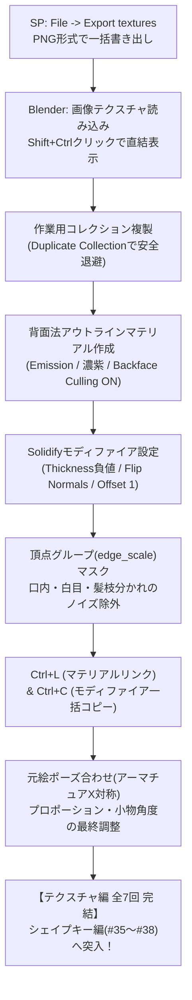

# ふさこ氏 キャラモデリング講座 #34 技術仕様書
## 【テクスチャ編07・完結】エクスポートと質感の調整 (Substance 3D Painter & Blender)

- **元動画**: [【Blender】キャラクターモデル制作！テクスチャ編07 エクスポートと質感の調整【3Dモデリング講座】](https://www.youtube.com/watch?v=hApZwvlJO4s)（動画ID: `hApZwvlJO4s`）
- **対象工程**: Substance Painterからのテクスチャ一括書き出し（Export Textures）、Blenderでの画像割り当てとNode Wrangler直結表示、安全なコレクション複製運用、背面法（Solidifyモディファイア）によるセルルック線画（アウトライン）の構築（Backface Culling、Flip Normals、Material Offset: 1）、頂点グループ（edge_scale）による口内・白目・髪の枝分かれノイズ除去、Copy Attributes Menu（Ctrl+L / Ctrl+C）による一括効率化、テクスチャ反映後のプロポーション・ポーズ最終バランス調整（アーマチュアX軸対称・プロポーショナル編集・小物のローカル軸回転）。
- **スクリーンショット一覧**: [docs/fusako_34_sp_export_materials_screenshots/README.md](../../docs/fusako_34_sp_export_materials_screenshots/README.md)

---

## 🎯 核心ワークフローサマリ

---

## 🛠️ 詳細手順仕様

### フェーズ1: Substance PainterからのエクスポートとBlenderノード接続

1. **Substance Painterでのエクスポート実行**:
   - `File` $\to$ `Export textures` を開く。
   - `Output directory` で保存先フォルダを指定し、`File type` を PNG に設定して一括エクスポート。
   - [📸 参考: fusako34_01_sp_file_export_textures_png.jpg](../../docs/fusako_34_sp_export_materials_screenshots/fusako34_01_sp_file_export_textures_png.jpg)
2. **Blenderでの画像テクスチャ読み込み**:
   - Blenderのシェーダーエディタを開き、各マテリアルの `Image Texture` ノードで出力されたPNG画像を割り当て。
   - [📸 参考: fusako34_02_blender_image_texture_node_open.jpg](../../docs/fusako_34_sp_export_materials_screenshots/fusako34_02_blender_image_texture_node_open.jpg)
3. **Node Wranglerによるダイレクト接続表示**:
   - `Shift + Ctrl + 左クリック`（Node Wranglerアドオン）で、Image Texture ノードを Material Output の Surface に直結。
   - ライティングの影響を受けないセル画本来の発色がプレビュー可能になる。
   - [📸 参考: fusako34_03_blender_node_wrangler_direct_output.jpg](../../docs/fusako_34_sp_export_materials_screenshots/fusako34_03_blender_node_wrangler_direct_output.jpg)
4. **ビューポートでの塗り残し・アラ点検**:
   - 3Dビューポートでモデルを全方位から回転させ、テクスチャの塗り残しや歪みをチェック。不具合があればSPに戻って手直しする。
   - [📸 参考: fusako34_04_blender_viewport_texture_check.jpg](../../docs/fusako_34_sp_export_materials_screenshots/fusako34_04_blender_viewport_texture_check.jpg)

---

### フェーズ2: 背面法（Solidify）によるセルルック・アウトライン構築

1. **コレクション複製による安全退避**:
   - 後からSPへ再エクスポートする可能性を考慮し、ベースモデルのコレクションを右クリック $\to$ **`Duplicate Collection`** で複製。
   - 複製したコレクション側でアウトラインモディファイアの付与やメッシュ調整を行う。
   - [📸 参考: fusako34_05_blender_duplicate_collection_safety.jpg](../../docs/fusako_34_sp_export_materials_screenshots/fusako34_05_blender_duplicate_collection_safety.jpg)
2. **アウトライン専用マテリアルの作成**:
   - 新規マテリアルを作成し、サーフェスを Principled BSDF から **`Emission`（放射）** に変更。
   - [📸 参考: fusako34_06_blender_outline_material_emission.jpg](../../docs/fusako_34_sp_export_materials_screenshots/fusako34_06_blender_outline_material_emission.jpg)
3. **アウトラインカラーとBackface Cullingの必須設定**:
   - 色は純黒ではなく、キャラクター全体のトーンに調和する「ダークパープル（濃い紫）」等を設定。
   - マテリアル設定（Settings）の **`Backface Culling`（裏面非表示）に必ずチェックを入れる**。
   - [📸 参考: fusako34_07_blender_backface_culling_color_pick.jpg](../../docs/fusako_34_sp_export_materials_screenshots/fusako34_07_blender_backface_culling_color_pick.jpg)
4. **Solidify（ソリッド化）モディファイアの設定値**:
   - メッシュに `Solidify` モディファイアを追加し、以下を設定:
     - `Thickness`: **マイナスの値**（例: `-0.005` 〜 `-0.01`）
     - `Normals`: **`Flip`（反転）にチェック**
     - `Material Offset`: **`1`**（スロット2番目のアウトラインマテリアルを指定）
   - [📸 参考: fusako34_08_blender_solidify_thickness_flip_offset.jpg](../../docs/fusako_34_sp_export_materials_screenshots/fusako34_08_blender_solidify_thickness_flip_offset.jpg)
5. **頂点グループ（edge_scale）マスクの構築**:
   - アウトラインが不要な部位（白目、口内など）をマスクするため、オブジェクトデータプロパティで新規頂点グループ **`edge_scale`** を作成。
   - Solidifyモディファイアの `Vertex Group` に `edge_scale` を割り当て。
   - [📸 参考: fusako34_09_blender_vertex_group_edge_scale_setup.jpg](../../docs/fusako_34_sp_export_materials_screenshots/fusako34_09_blender_vertex_group_edge_scale_setup.jpg)
6. **白目・口内のアウトライン除外**:
   - 編集モードで目の白目メッシュを選択し、`edge_scale` グループから `Remove`（ウェイト0化）。
   - [📸 参考: fusako34_10_blender_remove_eye_white_from_outline.jpg](../../docs/fusako_34_sp_export_materials_screenshots/fusako34_10_blender_remove_eye_white_from_outline.jpg)
   - 口の奥のメッシュ除外Tips: 唇のループを選択後、`Select` $\to$ `Select Loops` $\to$ **`Select Loop Inner-Region`** を実行すると、口内全体が一発で選択される。そのまま `Remove` してアウトラインを除去。
   - [📸 参考: fusako34_11_blender_select_loop_inner_region_mouth.jpg](../../docs/fusako_34_sp_export_materials_screenshots/fusako34_11_blender_select_loop_inner_region_mouth.jpg)

---

### フェーズ3: Copy Attributes による一括展開と髪の線画ノイズ対策

1. **マテリアルの一括リンク（Ctrl + L）**:
   - アウトラインマテリアルを付与したいオブジェクトを複数選択し、最後に設定済みオブジェクトをアクティブ選択。
   - **`Ctrl + L`** $\to$ **`Link Materials`** で一括割り当て。
   - [📸 参考: fusako34_12_blender_ctrl_l_link_materials.jpg](../../docs/fusako_34_sp_export_materials_screenshots/fusako34_12_blender_ctrl_l_link_materials.jpg)
2. **Solidifyモディファイアの一括コピー（Ctrl + C）**:
   - 設定済みオブジェクトをアクティブにした状態で、**`Ctrl + C`**（Copy Attributes Menu） $\to$ **`Copy Selected Modifiers`** $\to$ Solidify を選択。
   - 全身のパーツに一瞬で同一設定のアウトラインが適用される。
   - [📸 参考: fusako34_13_blender_ctrl_c_copy_solidify_modifier.jpg](../../docs/fusako_34_sp_export_materials_screenshots/fusako34_13_blender_ctrl_c_copy_solidify_modifier.jpg)
3. **全パーツへのアウトライン反映とワールド背景色の調整**:
   - ビューポートシェーディングで `Scene World` をONにし、Worldカラーを明るくしてアウトラインの出方を明瞭に確認。
   - [📸 参考: fusako34_14_blender_batch_outline_applied_all.jpg](../../docs/fusako_34_sp_export_materials_screenshots/fusako34_14_blender_batch_outline_applied_all.jpg)
   - [📸 参考: fusako34_15_blender_scene_world_background_color.jpg](../../docs/fusako_34_sp_export_materials_screenshots/fusako34_15_blender_scene_world_background_color.jpg)
4. **髪の毛の枝分かれ（毛先交差部）の線画ノイズ問題**:
   - 髪の毛先や枝分かれしたV字の谷間部分に、背面法特有の黒い重なりノイズが発生する問題。
   - [📸 参考: fusako34_16_blender_hair_outline_branch_artifact.jpg](../../docs/fusako_34_sp_export_materials_screenshots/fusako34_16_blender_hair_outline_branch_artifact.jpg)
5. **髪用頂点グループによる線画ノイズの解消**:
   - 髪専用のマスク頂点グループを作成し、交差する谷間の頂点ウェイトを `0`（または極小）に設定。
   - 不自然な黒い塊が消え、スッキリとした美しいアニメ毛束ラインが完成。
   - [📸 参考: fusako34_17_blender_hair_vertex_group_clean_outline.jpg](../../docs/fusako_34_sp_export_materials_screenshots/fusako34_17_blender_hair_vertex_group_clean_outline.jpg)

---

### フェーズ4: テクスチャ反映後のプロポーション・ポーズ最終バランス調整

1. **元絵リファレンスとの横並び比較準備**:
   - 正面を向いたデザイン原画をモデルの真横に配置し、不透明度を調整。
   - [📸 参考: fusako34_18_blender_proportion_review_reference_side.jpg](../../docs/fusako_34_sp_export_materials_screenshots/fusako34_18_blender_proportion_review_reference_side.jpg)
2. **アーマチュアのポーズ合わせ（X軸対称）**:
   - ポーズモードに入り、ヘッダーの **`X-Axis Mirror`（X軸対称）** をONにして、元絵と同じ立ち姿ポーズを取らせる。
   - [📸 参考: fusako34_19_blender_armature_pose_x_symmetry_match.jpg](../../docs/fusako_34_sp_export_materials_screenshots/fusako34_19_blender_armature_pose_x_symmetry_match.jpg)
3. **プロポーショナル編集による足の長さ調整**:
   - 足と靴を選択し、プロポーショナル編集（`O`）をONにして下方に引き下げ、元絵のすらっとした等身バランスに合わせる。
   - [📸 参考: fusako34_20_blender_proportional_edit_leg_length.jpg](../../docs/fusako_34_sp_export_materials_screenshots/fusako34_20_blender_proportional_edit_leg_length.jpg)
4. **袖のボリューム・萌え袖の調整**:
   - 手がすっぽり隠れる萌え袖の長さ、膨らみ、首周りの広がりを徹底調整。
   - [📸 参考: fusako34_21_blender_sleeve_volume_hands_adjustment.jpg](../../docs/fusako_34_sp_export_materials_screenshots/fusako34_21_blender_sleeve_volume_hands_adjustment.jpg)
5. **ポシェットのローカル回転調整**:
   - 肩紐を `P` キーで一時的に別オブジェクトに分離。
   - ポシェット本体のみ、トランスフォーム座標系を **`Orientation: Normal` または `Local`** に切り替えて傾き（反時計回り）を微調整。
   - [📸 参考: fusako34_22_blender_pochette_strap_separate_local_rot.jpg](../../docs/fusako_34_sp_export_materials_screenshots/fusako34_22_blender_pochette_strap_separate_local_rot.jpg)
6. **ウェイト転送用素体の同期修正（最重要注意点）**:
   - 足や腕の位置を変更した場合、後からウェイト転送を再適用する際にズレが生じないよう、**ウェイト転送元である「素体メッシュ」側の関節位置も必ず同期して移動・修正**しておくこと！
   - [📸 参考: fusako34_23_blender_final_balance_weight_transfer_note.jpg](../../docs/fusako_34_sp_export_materials_screenshots/fusako34_23_blender_final_balance_weight_transfer_note.jpg)
7. **テクスチャ編完結とシェイプキー編への予告**:
   - モデリング、リギング、UV、テクスチャ、アウトライン、最終バランス調整がすべて完了！
   - 次回（第35話）より「シェイプキー編（あいうえお口・まばたき・表情制作）」へ進出。
   - [📸 参考: fusako34_24_blender_sp_texture_series_completed.jpg](../../docs/fusako_34_sp_export_materials_screenshots/fusako34_24_blender_sp_texture_series_completed.jpg)

---

## 💡 プロ直伝Tips & ノウハウまとめ

1. **背面法アウトラインの3大必須設定**:
   - ① マテリアルの `Backface Culling` をONにする（裏返した面だけを手前に見せるため）。
   - ② Solidify の `Thickness` をマイナス値、`Flip Normals` をONにする。
   - ③ `Material Offset` を `1` にする（メインマテリアルの次のスロットを参照させる）。
2. **Select Loop Inner-Region による口腔奥の瞬時選択**:
   - 口の中を1面ずつ選択するのは大変だが、開口部のエッジループを `Alt + クリック` して `Select -> Select Loops -> Select Loop Inner-Region` を実行するだけで、奥の閉じた領域を全選択できる。マスク除外の超時短ワザ。
3. **テクスチャ後のバランス見直し（重要度：特大）**:
   - 形状（グレーモデル）の段階と、色・線画が入った段階では、錯視により頭身や手足の長さの印象が大きく変化する。
   - アーマチュアでポーズを取らせ、原画と真横に並べて最終プロポーションを再調整する工程を挟むことが、商業クオリティのアニメモデルに仕上げる最大の秘訣。
