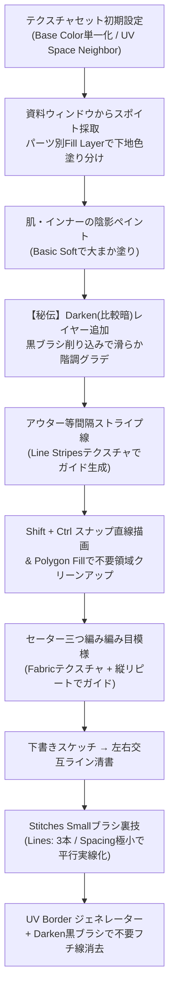

# ふさこ氏 キャラモデリング講座 #32 技術仕様書
## 【テクスチャ編05】アウターや肌のペイント (Substance 3D Painter)

- **元動画**: [【Blender】キャラクターモデル制作！テクスチャ編05 アウターや肌のペイント【3Dモデリング講座】](https://www.youtube.com/watch?v=FbRFGbE8VdU)（動画ID: `FbRFGbE8VdU`）
- **対象工程**: テクスチャセット初期化とカラー採取、肌・インナーの多層セルシェーディングと滑らかな階調影技法（Darken比較暗フェード）、等間隔ストライプ線のプロシージャルガイド（Line Stripes）と完全直線描画ショートカット、ニットセーターの三つ編み編み込み模様のガイド作成（Fabric）と手描き清書、ステッチブラシを活用した平行3本実線化の裏技、UV BorderとDarkenマスクによるフチ取りラインの最適化。
- **スクリーンショット一覧**: [docs/fusako_32_sp_outer_skin_screenshots/README.md](../../docs/fusako_32_sp_outer_skin_screenshots/README.md)

---

## 🎯 核心ワークフローサマリ

---

## 🛠️ 詳細手順仕様

### フェーズ1: テクスチャセット初期化とベースカラーの塗り分け

1. **初期チャンネル設定と最適化**:
   - 各テクスチャセットごとに作業解像度（2048または最終出力サイズ）を設定。
   - アニメ・セルルック制作のため、不要な `Metallic`, `Roughness`, `Normal`, `Height` チャンネルを削除し、`Base Color` 単一チャンネルのみ保持。
   - テクスチャ設定のパディングを `UV Space Neighbor` に設定。
   - [📸 参考: fusako32_01_sp_texture_set_size_basecolor_only.jpg](../../docs/fusako_32_sp_outer_skin_screenshots/fusako32_01_sp_texture_set_size_basecolor_only.jpg)
2. **参考資料からのカラー採取とベタ塗りレイヤー**:
   - 別ウィンドウにキャラクターのデザイン立ち絵を配置。
   - Fill Layer の Base Color プロパティにあるスポイトツールを用い、資料画像から直接固有色をピック。
   - パーツごと（インナー、肌、アウター、アクセサリー等）にFill Layerを作成してベース色を割り当て。
   - [📸 参考: fusako32_02_sp_reference_eyedropper_fill_layers.jpg](../../docs/fusako_32_sp_outer_skin_screenshots/fusako32_02_sp_reference_eyedropper_fill_layers.jpg)
3. **全パーツ下地色塗り分け完了**:
   - 全身の各部位にベタ塗り基本色が割り当てられた状態を確認。
   - [📸 参考: fusako32_03_sp_base_colors_all_parts_done.jpg](../../docs/fusako_32_sp_outer_skin_screenshots/fusako32_03_sp_base_colors_all_parts_done.jpg)

---

### フェーズ2: 肌・インナーのペイントと滑らかな階調グラデーション

1. **インナー作業準備と対称ペイント**:
   - 作業の邪魔になる手前のアウターやポシェットを一時的に非表示（Hide）化。
   - `L` キーを押して左右対称（Symmetry）ペイントをONにし、効率的に両側へ同時描画。
   - [📸 参考: fusako32_04_sp_inner_hide_outer_l_symmetry.jpg](../../docs/fusako_32_sp_outer_skin_screenshots/fusako32_04_sp_inner_hide_outer_l_symmetry.jpg)
2. **肌の影・第一段階（ラフ塗り）**:
   - 太もも・膝裏・鎖骨周りなどの落ち影を、ブラシ `Basic Soft` を使用して少し硬めにざっくり配置。
   - [📸 参考: fusako32_05_sp_skin_shadow_rough_pass.jpg](../../docs/fusako_32_sp_outer_skin_screenshots/fusako32_05_sp_skin_shadow_rough_pass.jpg)
3. **【秘伝技法】Darken（比較暗）レイヤーによる自然な階調づくり**:
   - **問題点**: Substance Painterに標準搭載されている「ぼかし（Blur）ブラシ」は、ストロークが汚く濁りやすく、イラスト調の綺麗なグラデーションが作りにくい。
   - **解決策**: ラフ塗りレイヤーの上に新規ペイントレイヤーを追加し、ブレンドモードを **`Darken`（比較暗）** に変更。
   - 柔らかめのブラシ（Basic Soft等）を選択し、**黒色（Black）** で影の境界を少しずつ加筆・馴染ませていく。
   - [📸 参考: fusako32_06_sp_skin_darken_blend_gradient_brush.jpg](../../docs/fusako_32_sp_outer_skin_screenshots/fusako32_06_sp_skin_darken_blend_gradient_brush.jpg)
4. **消しゴム的フェードアウトでアニメ肌を完成**:
   - 元のラフ影を消すのではなく、Darkenレイヤー上で柔らかいブラシで削り込むように塗ることで、非破壊かつ極めてなめらかなアニメ調セルグラデーションが完成。
   - [📸 参考: fusako32_07_sp_skin_soft_fade_eraser_technique.jpg](../../docs/fusako_32_sp_outer_skin_screenshots/fusako32_07_sp_skin_soft_fade_eraser_technique.jpg)

---

### フェーズ3: アウターの等間隔ストライプ線と完全直線ショートカット

1. **等間隔ストライプ線の課題**:
   - アウターのボーダー・ストライプ柄は、フリーハンドの手描きだけでは間隔が不均一になりがち。目印となる「プロシージャルガイド」を作成する。
   - [📸 参考: fusako32_08_sp_outer_stripe_guide_motivation.jpg](../../docs/fusako_32_sp_outer_skin_screenshots/fusako32_08_sp_outer_stripe_guide_motivation.jpg)
2. **プロシージャルガイドレイヤーの構築**:
   - 視認しやすい鮮やかな色のFill Layerを作成し、黒マスク（Add black mask）を追加。
   - マスクを右クリック $\to$ `Add fill`（塗りつぶしエフェクト）を追加。
   - [📸 参考: fusako32_09_sp_outer_fill_mask_fill_setup.jpg](../../docs/fusako_32_sp_outer_skin_screenshots/fusako32_09_sp_outer_fill_mask_fill_setup.jpg)
3. **Line Stripes テクスチャのパラメータ設定**:
   - プロシージャルライブラリから `Line Stripes` を検索し、Fillエフェクトの `Grayscale` スロットにドラッグ＆ドロップ。
   - `Bend` を `0` に設定して曲がりを完全に排除し、まっすぐな直線にする。
   - `Rotation` を `90` 度に変更し、服のボーダー方向（水平）に合わせる。
   - [📸 参考: fusako32_10_sp_line_stripes_bend0_rot90.jpg](../../docs/fusako_32_sp_outer_skin_screenshots/fusako32_10_sp_line_stripes_bend0_rot90.jpg)
4. **2Dビューでのギズモ操作と等間隔スケーリング**:
   - 2Dテクスチャビューに切り替え、表示される薄い四角形のマニピュレーター（ギズモ）の角をドラッグ。
   - 元絵の分割数（縦9本など）に合わせてスケールを拡大縮小し、完璧な等間隔ストライプガイドを完成。
   - ガイドレイヤーの不透明度を20〜30%に下げて下敷きにする。
   - [📸 参考: fusako32_11_sp_2d_view_gizmo_scale_stripes.jpg](../../docs/fusako_32_sp_outer_skin_screenshots/fusako32_11_sp_2d_view_gizmo_scale_stripes.jpg)
5. **完全な直線（Straight Line）を引く神ショートカット**:
   - 新規ペイントレイヤーを作成し、ブラシプロパティを設定:
     - `Alignment`: **`UV`**
     - `Size Space`: **`Texture`**
   - **操作手順**:
     1. 直線の始点を左クリック。
     2. **`Shift`** を押しながらマウスを動かす（直線プレビューの点線が表示される）。
     3. さらに **`Ctrl`** を同時に押し込むと、直線の角度が一定刻み（水平・垂直・45度等）に**完全スナップ固定**される！
     4. 目的の位置で左クリック。UV上で寸分違わぬ真直ぐなラインが引ける。
   - [📸 参考: fusako32_12_sp_brush_straight_line_shift_ctrl.jpg](../../docs/fusako_32_sp_outer_skin_screenshots/fusako32_12_sp_brush_straight_line_shift_ctrl.jpg)
6. **直線清書とPolygon Fillによるクリーンアップ**:
   - ガイドに沿って直線を一気に引き、シーム外や裏面にはみ出た不要な線は `Polygon Fill`（黒塗り・UV Chunk Fill）でクリックして一発消去。
   - [📸 参考: fusako32_13_sp_guide_draw_clean_polygon_fill.jpg](../../docs/fusako_32_sp_outer_skin_screenshots/fusako32_13_sp_guide_draw_clean_polygon_fill.jpg)

---

### フェーズ4: ニット・セーターの編み目模様（三つ編み模様）とステッチ裏技

1. **三つ編み編み込み模様の課題**:
   - セーター特有の交差する毛糸編み目（アラン模様/ケーブル編み）を手作業だけで正確に描くのは困難。
   - [📸 参考: fusako32_14_sp_sweater_knit_pattern_intro.jpg](../../docs/fusako_32_sp_outer_skin_screenshots/fusako32_14_sp_sweater_knit_pattern_intro.jpg)
2. **Fabric テクスチャの適用**:
   - Fill Layer + 黒マスク + Fillエフェクトを作成。
   - テクスチャライブラリから `Fabric`（編み目模様）を検索し、Grayscaleスロットに投入。
   - [📸 参考: fusako32_15_sp_fabric_texture_in_fill_mask.jpg](../../docs/fusako_32_sp_outer_skin_screenshots/fusako32_15_sp_fabric_texture_in_fill_mask.jpg)
3. **縦リピートとアスペクト比維持調整**:
   - Fillプロパティの Repeat を **`Repeat Vertically`（縦方向のみ反復）** に変更。
   - **`Shift`** を押しながらギズモの角をドラッグし、縦横比を歪ませずに適切な編み目サイズにリサイズ。
   - [📸 参考: fusako32_16_sp_repeat_vertically_shift_aspect.jpg](../../docs/fusako_32_sp_outer_skin_screenshots/fusako32_16_sp_repeat_vertically_shift_aspect.jpg)
4. **ギズモ回転による向きの最適化**:
   - 2Dビュー上でギズモの外周近くにカーソルを合わせると回転アイコンに変化。ドラッグして180度回転させ、編み目の下向き・上向きの交差方向をモデルに整合。
   - [📸 参考: fusako32_17_sp_gizmo_rotation_knit_alignment.jpg](../../docs/fusako_32_sp_outer_skin_screenshots/fusako32_17_sp_gizmo_rotation_knit_alignment.jpg)
5. **編み目の下書きスケッチ**:
   - ガイドを薄く表示し、新規ペイントレイヤーで `Basic Hard` ブラシ（筆圧OFF）を使って大まかな編み目の節を下書き。
   - [📸 参考: fusako32_18_sp_sweater_rough_sketch_layer.jpg](../../docs/fusako_32_sp_outer_skin_screenshots/fusako32_18_sp_sweater_rough_sketch_layer.jpg)
6. **本番清書: 左右交互の編み込みストローク**:
   - 下書きを薄くし、本番用ペイントレイヤーを作成。
   - 左上から右下へ流れる毛束、右上から左下へ潜り込む毛束を交互に描き、立体的な三つ編み構造を清書。
   - [📸 参考: fusako32_19_sp_sweater_final_interlocking_lines.jpg](../../docs/fusako_32_sp_outer_skin_screenshots/fusako32_19_sp_sweater_final_interlocking_lines.jpg)
7. **ガイド・下書き非表示でセーター模様完成**:
   - 下書きとプロシージャルガイドを非表示にすることで、自然な手描き感を保ちながら幾何学的に整列したセーター模様が完成。
   - [📸 参考: fusako32_20_sp_sweater_pattern_clean_result.jpg](../../docs/fusako_32_sp_outer_skin_screenshots/fusako32_20_sp_sweater_pattern_clean_result.jpg)
8. **点線・ステッチブラシの活用**:
   - ブラシライブラリで `Stitch` を検索し、`Stitches Small` を選択。服の縫い目（点線）を等間隔で軽快に描画。
   - [📸 参考: fusako32_21_sp_brush_stitches_small_dotted.jpg](../../docs/fusako_32_sp_outer_skin_screenshots/fusako32_21_sp_brush_stitches_small_dotted.jpg)
9. **【超絶裏技】ステッチブラシで「平行3本実線」を一筆描画**:
   - 平行な2本線や3本線を手描きで引くのは至難の業。
   - `Stitches Small` ブラシのプロパティで:
     - `Lines`: **`3`**（3本線にする）
     - `Scale` / `Scale Y`: 幅を調整
     - **`Spacing`（間隔）: 極小値（最小）まで詰める**！
   - **結果**: 点と点の間隔がゼロになり、**完全に平行な3本の実線**を一筆ストロークで描くことができる！
   - [📸 参考: fusako32_22_sp_stitches_lines3_parallel_solid.jpg](../../docs/fusako_32_sp_outer_skin_screenshots/fusako32_22_sp_stitches_lines3_parallel_solid.jpg)

---

### フェーズ5: UV Border と Darkenマスクによるフチ取りラインの最適化

1. **UV Border ジェネレーターの適用**:
   - アウターの裾や袖口のフチに沿ったパイピング線を描くため、Fill Layer + 黒マスクに `Add generator` $\to$ `UV Border` を適用。
   - [📸 参考: fusako32_23_sp_uv_border_generator_outer_edge.jpg](../../docs/fusako_32_sp_outer_skin_screenshots/fusako32_23_sp_uv_border_generator_outer_edge.jpg)
2. **Darkenペイントレイヤーによる不要フチ線の消去**:
   - UV Borderは全シーム境界に線が出るため、襟元や背面の不要な線も現れてしまう。
   - マスク内に新規ペイントレイヤーを追加し、ブレンドモードを **`Darken`（比較暗）** に設定。
   - 黒ブラシで不要なフチ線を塗りつぶすことで、目的の裾や袖口のフチ線だけを綺麗に残して完成。
   - [📸 参考: fusako32_24_sp_darken_mask_clean_unwanted_borders.jpg](../../docs/fusako_32_sp_outer_skin_screenshots/fusako32_24_sp_darken_mask_clean_unwanted_borders.jpg)

---

## 💡 プロ直伝Tips & ノウハウまとめ

1. **ぼかしブラシの罠とDarken黒ブラシ削り込み**:
   - SPのBlurブラシはストローク品質が安定せず、エッジが毛羽立ったり濁ったりしやすい。
   - アニメ塗りのグラデーションは「硬い影を置く $\to$ 上層Darkenレイヤーの黒ブラシ（ソフト）で削る」という消しゴム的アプローチが最もコントロール性が高く美しい仕上がりになる。
2. **プロシージャルテクスチャのガイド運用（Line Stripes / Fabric）**:
   - プロシージャルテクスチャをそのまま本番テクスチャとして使うと「CG感・無機質さ」が出てしまう。
   - 一度ガイド（不透明度20%）として表示し、その上を手描きでなぞる（トレスする）ことで、「手描きの温かみ・揺らぎ」と「整然とした幾何学的ピッチ」を両立できる。
3. **StitchesブラシのSpacing極小化による多条線生成**:
   - 2本線・3本線の平行ラインはデザインで多用されるが、定規ツールでも手間がかかる。
   - StitchesブラシのSpacingを極小に詰めることで、リピートされたドットが連結して完全な平行マルチラインに化ける。非常に強力な時短テクニック。
