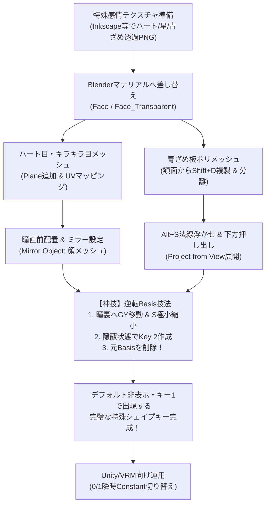

# ふさこ氏『Blenderでキャラクターモデル制作！』第38話 技術仕様書
## 04 | ハート目・キラキラ目・青ざめなどの特殊シェイプキー【シェイプキー編 完結】

---

### 1. 動画情報概要

- **講義名**: 04 | ハート/キラキラ/青ざめ等のシェイプキー 〜中級者向けチュートリアル〜
- **動画URL**: [https://www.youtube.com/watch?v=GC37bbvRjqU](https://www.youtube.com/watch?v=GC37bbvRjqU)
- **動画ID**: `GC37bbvRjqU`
- **再生時間**: 24分24秒 (1464秒)
- **主目的**:
  1. 通常の顔メッシュの頂点変形だけでは不可能な「ハート目」「キラキラ目」「青ざめ（おでこシャドウ）」など、特殊な漫画的感情表現パーツの追加制作。
  2. ベクターソフト（Inkscape等）で描いた透過テクスチャをBlenderに差し替え、UV島へマッピングする効率的アトラス手法。
  3. **【超絶神技】「瞳裏への縮小隠蔽 $\to$ 新規キー作成 $\to$ 元Basis削除（逆転Basis）」による、デフォルト非表示・キーONで拡大出現するシェイプキー構築法**。
  4. 顔メッシュの額領域から直接面を複製・分離（`Shift+D` $\to$ `P`）し、`Alt+S` で法線オフセットして作るジャストフィットな青ざめ板ポリの制作。
  5. 透過マテリアル（`Alpha Hashed`）設定と、正面視点からの `Project from View`（ビューから投影）による歪みのないUV展開。
  6. **Unity / VRM / VRChat向けのアニメーション設計思想（中間値の貫通を気にせず0/1ステップ切り替えで運用する業界デファクト手法）**。
  7. 【付録】Inkscapeによるハート・星・線形グラデーション（青〜透明）ベクターアセット制作実践。

---

### 2. 特殊感情表現パーツの設計思想

---

### 3. 詳細実装手順

#### ステップ1: テクスチャの準備とBlenderマテリアルへの差し替え

1. **特殊アセットの全体構想**:
   - 漫画・アニメ的な誇張表現（恋するハート目、興奮したキラキラ星目、恐怖・絶望・ショックの青ざめ額シャドウ）は、瞳テクスチャそのものを動的に差し替えるか、手前に透過メッシュを出現させることで表現する。
   - [📸 参考: fusako38_01_blender_special_shapekeys_concept_overview.jpg](../../docs/fusako_38_special_shapekey_screenshots/fusako38_01_blender_special_shapekeys_concept_overview.jpg)
2. **ベクターテクスチャの準備**:
   - 無料ベクターソフト（InkscapeやIllustrator）を使用し、顔テクスチャの空き領域、または透過テクスチャ（`T_Chara_Face_Transparent.png`）上にハート、4点星、縦グラデーションの青ざめ矩形を配置する。
   - [📸 参考: fusako38_02_inkscape_vector_assets_heart_star_aozame.jpg](../../docs/fusako_38_special_shapekey_screenshots/fusako38_02_inkscape_vector_assets_heart_star_aozame.jpg)
3. **PNG書き出し**:
   - `Shift + Ctrl + E` で書き出しダイアログを開き、書き出し範囲を「選択範囲」またはキャンバス全体（1024x1024）に設定してPNG保存。
   - [📸 参考: fusako38_03_inkscape_texture_export_resolution_path.jpg](../../docs/fusako_38_special_shapekey_screenshots/fusako38_03_inkscape_texture_export_resolution_path.jpg)
4. **Blenderマテリアルへの差し替え**:
   - Blenderに戻り、顔マテリアル（または透過マテリアル）のテクスチャノードのフォルダアイコンから、新しく書き出したPNGテクスチャを読み込み直す。
   - [📸 参考: fusako38_04_blender_face_texture_swap_plane_add.jpg](../../docs/fusako_38_special_shapekey_screenshots/fusako38_04_blender_face_texture_swap_plane_add.jpg)

---

#### ステップ2: ハート目・キラキラ目メッシュの作成とUVマッピング

1. **平面（Plane）メッシュの追加とUVフィット**:
   - 3Dカーソルを原点（`Shift + S` $\to$ `Cursor to World Origin`）に配置。
   - `Shift + A` $\to$ `Mesh > Plane` を追加。
   - UVエディターを開き、平面の4頂点をテクスチャ上のハート領域の四隅にぴったり合わせる。
   - [📸 参考: fusako38_05_blender_plane_uv_map_to_heart_area.jpg](../../docs/fusako_38_special_shapekey_screenshots/fusako38_05_blender_plane_uv_map_to_heart_area.jpg)
2. **中央頂点マージ（`S 0`）によるUV歪み解消**:
   - ハートの中央や内側にエッジを追加した際、プロポーショナル編集をオフにした状態で `S 0` を実行し、中央頂点を完全に1点に集約整列させる。
   - これにより、3D空間でメッシュが斜めに歪んでもテクスチャが綺麗に正方形比率でマッピングされる。
   - [📸 参考: fusako38_06_blender_center_vertex_merge_s0_uv_fix.jpg](../../docs/fusako_38_special_shapekey_screenshots/fusako38_06_blender_center_vertex_merge_s0_uv_fix.jpg)
3. **瞳前への配置とミラーモディファイア設定**:
   - `R X 90` で正面を向かせ、`S` キーで瞳サイズまで縮小。
   - 瞳のすぐ手前（微小な前オフセット）に配置し、少し可愛らしく傾ける。
   - `Mirror` モディファイアを追加し、`Mirror Object` にスポイトで顔オブジェクト（`Face`）を指定して左右両目に配置。
   - [📸 参考: fusako38_07_blender_heart_align_pupil_mirror_setup.jpg](../../docs/fusako_38_special_shapekey_screenshots/fusako38_07_blender_heart_align_pupil_mirror_setup.jpg)

---

#### ステップ3: 【超絶神技】「縮小隠蔽 $\to$ 逆転Basis」による出現シェイプキー作成法

通常時は非表示（消えている）で、シェイプキースライダーを `1.0` にした時だけ瞳からピュッと拡大出現するプロの作成法。

1. **初期BasisとKey 1の作成**:
   - ハート目オブジェクトを選択し、オブジェクトデータプロパティのシェイプキーパネルへ。
   - `+` を押して標準の出現状態を **`Basis`** として登録。
   - 再び `+` を押して **`Key 1`** を作成。
   - [📸 参考: fusako38_08_blender_shapekey_basis_and_key1_pull_back.jpg](../../docs/fusako_38_special_shapekey_screenshots/fusako38_08_blender_shapekey_basis_and_key1_pull_back.jpg)
2. **Key 1での瞳裏引き込みと極小縮小（隠蔽状態）**:
   - `Key 1` を選択して編集モードに入る。
   - `G Y` でメッシュを瞳の奥（頭部内部）へ後退させる。
   - `S` キーで極小（ほぼ点サイズ）に縮小する。
   - これで「通常は瞳の裏に小さく隠れている形状」ができる。
   - [📸 参考: fusako38_09_blender_gy_depth_hide_scale_zero_behind_eye.jpg](../../docs/fusako_38_special_shapekey_screenshots/fusako38_09_blender_gy_depth_hide_scale_zero_behind_eye.jpg)
3. **【問題の発生】デフォルトで出現してしまう**:
   - オブジェクトモードに戻ると、Basis（値0）の時にハートが表示され、Key 1（値1）にした時に消えるという「逆の動作」になっている。
   - [📸 参考: fusako38_10_blender_hidden_to_show_reverse_problem.jpg](../../docs/fusako_38_special_shapekey_screenshots/fusako38_10_blender_hidden_to_show_reverse_problem.jpg)
4. **【解決の神技】元のBasisを削除して昇格させる（逆転Basis）**:
   - `Key 1`（隠蔽状態）を選択したまま、何もいじらずに `+` ボタンを押して **`Key 2`** を作成。
   - この状態で、一番上の **`Basis` を選択して `-`（マイナス）ボタンで削除** する！
   - すると、隠蔽状態（極小）が新たなデフォルト形状（Basis）へと昇格し、`Key 2`（＝元の出現サイズ）が単独キーとして残る！
   - [📸 参考: fusako38_11_blender_reverse_basis_technique_delete_basis.jpg](../../docs/fusako_38_special_shapekey_screenshots/fusako38_11_blender_reverse_basis_technique_delete_basis.jpg)
5. **リネームと動作確認**:
   - 新たなBasisを `Basis`、出現キーの名前を **`eye_heart`** に変更。
   - スライダーを0から1へ動かすと、瞳の奥からピュッと拡大しながら前に飛び出してくる完璧な出現アニメーションが完成！
   - [📸 参考: fusako38_12_blender_eye_heart_pop_out_shapekey_complete.jpg](../../docs/fusako_38_special_shapekey_screenshots/fusako38_12_blender_eye_heart_pop_out_shapekey_complete.jpg)
6. **キラキラ目（`eye_star`）の同様作成**:
   - キラキラ星メッシュも全く同様の手法でモデリング・UV配置し、逆転Basis技法で **`eye_star`** を作成する。
   - [📸 参考: fusako38_13_blender_eye_star_kirakira_reverse_basis.jpg](../../docs/fusako_38_special_shapekey_screenshots/fusako38_13_blender_eye_star_kirakira_reverse_basis.jpg)

---

#### ステップ4: 青ざめメッシュ（おでこ板ポリ）の抽出・作成

1. **VRM標準モデル「アリシア・ソリッド」の構造参照**:
   - VRM公式サンプルモデル「アリシアちゃん」の青ざめ表現を確認すると、額の曲面に完全に一致する湾曲板ポリに透過テクスチャを貼り、シェイプキーで出し入れしていることがわかる。
   - [📸 参考: fusako38_14_vrm_alicia_solid_aozame_forehead_reference.jpg](../../docs/fusako_38_special_shapekey_screenshots/fusako38_14_vrm_alicia_solid_aozame_forehead_reference.jpg)
2. **額面の選択（ミラー選択Extend）**:
   - 顔メッシュを選択して編集モードへ。`L` キーで顔の肌部分のみを選択し、`Shift + H` でそれ以外を非表示にする。
   - 面選択モード（`3`）で額の面を片側選択。
   - **`Shift + Ctrl + M`**（ミラー選択）を実行し、左下のオペレータパネルで **`Extend: ON`**（拡張）にチェックを入れると、左右両側の額面が一発で完全対称選択される！
   - [📸 参考: fusako38_15_blender_forehead_mesh_mirror_select_extend.jpg](../../docs/fusako_38_special_shapekey_screenshots/fusako38_15_blender_forehead_mesh_mirror_select_extend.jpg)
3. **複製と別オブジェクト分離**:
   - `Shift + D` $\to$ `ESC` でその場に複製。
   - `P` キー $\to$ **`Selection`**（選択物）で別オブジェクトとして分離。
   - [📸 参考: fusako38_16_blender_duplicate_shift_d_separate_p.jpg](../../docs/fusako_38_special_shapekey_screenshots/fusako38_16_blender_duplicate_shift_d_separate_p.jpg)
4. **既存シェイプキーの全消去とマテリアル割り当て**:
   - 分離した新オブジェクトを選択。顔メッシュから引き継いだシェイプキーを、下矢印メニュー $\to$ **`Delete All Shape Keys`**（全シェイプキー削除）で完全にクリア。
   - マテリアルスロットに透過テクスチャマテリアル（`Face_Transparent`）を割り当てる。
   - [📸 参考: fusako38_17_blender_delete_all_shapekeys_transparent_mat.jpg](../../docs/fusako_38_special_shapekey_screenshots/fusako38_17_blender_delete_all_shapekeys_transparent_mat.jpg)
5. **法線オフセット（`Alt + S`）と下部押し出し**:
   - 顔肌との重なりによるチラつき（Zファイト）を防ぐため、全選択して **`Alt + S`**（法線に沿って収縮/膨張）でわずかに（数ミリ）外側へ浮かせる。
   - 額の下端エッジを選択し、`E` キーで目の直上あたりまで下方向へ押し出す。
   - [📸 参考: fusako38_18_blender_alt_s_normal_offset_extrude_down.jpg](../../docs/fusako_38_special_shapekey_screenshots/fusako38_18_blender_alt_s_normal_offset_extrude_down.jpg)

---

#### ステップ5: 透過設定と正面投影UV展開

1. **マテリアルの透過ブレンドモード設定**:
   - マテリアルプロパティ $\to$ `Settings` $\to$ **`Blend Mode`** を **`Alpha Hashed`**（または `Alpha Blend`）に設定。
   - これにより、アルファ値（透明度）に応じた滑らかなフェード表示が可能になる。
   - [📸 参考: fusako38_19_blender_material_alpha_hashed_blend_mode.jpg](../../docs/fusako_38_special_shapekey_screenshots/fusako38_19_blender_material_alpha_hashed_blend_mode.jpg)
2. **Project from Viewによる正面投影展開**:
   - テンキー `1` を押して真正面正射影ビューにする。
   - 編集モードで全選択（`A`）$\to$ `U` キー $\to$ **`Project from View`**（ビューから投影）を実行。
   - UVエディター上で青ざめグラデーション領域に重ね合わせることで、歪みのない完璧な縦落ちシャドウが額に投影される。
   - [📸 参考: fusako38_20_blender_uv_project_from_view_forehead.jpg](../../docs/fusako_38_special_shapekey_screenshots/fusako38_20_blender_uv_project_from_view_forehead.jpg)

---

#### ステップ6: 青ざめシェイプキー構築とUnity向け設計思想

1. **頭部内への縮小隠蔽**:
   - 青ざめオブジェクトにBasisとKey 1を作成。Key 1でメッシュを縮小して頭部内部（額の裏）へ押し込む。
   - [📸 参考: fusako38_21_blender_aozame_shapekey_hide_and_unity_instant_switch.jpg](../../docs/fusako_38_special_shapekey_screenshots/fusako38_21_blender_aozame_shapekey_hide_and_unity_instant_switch.jpg)
2. **【超重要】中間値（0.5）での歪みとUnity/VRMでの運用思想**:
   - スライダーを0.5にした際、板ポリが額の内部から突き破るように拡大するため、中間フレームでは不自然なメッシュ貫通が発生する。
   - **【プロの結論】**:
     - UnityやVRChat、ゲームエンジンでは、漫符・特殊感情シェイプキーは線形補間（Linear）せず、**「0から1へ瞬時に切り替える（Constant/Step）」運用が基本**。そのため中間値の貫通は実用上全く問題とならない。
     - もし「徐々に青ざめさせたい」演出を行う場合は、Unity内でマテリアルのUVスクロールやアルファ値をアニメーションさせるか、メッシュの縮小起点を額の上端にして「上からカーテンのように下りてくる」変形にするのがスマートである。
3. **逆転Basisの適用と完成**:
   - 縮小状態でKey 2作成 $\to$ 元Basis削除 $\to$ 新キー名を **`extra_aozame`** にリネーム。
   - これにて、すべての特殊表情シェイプキーが完全に完成！
   - [📸 参考: fusako38_22_blender_extra_aozame_shapekey_reverse_complete.jpg](../../docs/fusako_38_special_shapekey_screenshots/fusako38_22_blender_extra_aozame_shapekey_reverse_complete.jpg)

---

#### 付録: ベクターツール（Inkscape）による特殊感情テクスチャ制作手順

動画後半（20:00〜）で解説されている、Inkscapeによる漫符アセット制作の実践ノウハウ。

1. **ハートのベクター描画**:
   - ベジェ曲線ツール（`B`）でハートの輪郭を大まかに数点でクリックして閉じたパスを作る。
   - ノードツール（`N`）で頂点を選択し、ツールバーの **「選択ノードをスムーズにする」** を実行。
   - ハンドルを調整してふっくらとした愛らしいハートを形成。
   - [📸 参考: fusako38_23_inkscape_heart_bezier_nodes_smooth_edit.jpg](../../docs/fusako_38_special_shapekey_screenshots/fusako38_23_inkscape_heart_bezier_nodes_smooth_edit.jpg)
2. **青ざめ線形グラデーションの作成**:
   - 矩形ツール（`R`）で長方形を作成。
   - フィル＆ストロークパネルでストローク（枠線）をOFFにし、フィルに「線形グラデーション」を指定。
   - 開始ノードに濃紺・青紫（不透明度100%）、終了ノードに同一色の透明（アルファ0%）を指定。
   - ツールバーの「時計回りに90度回転」を押し、上が濃く下が透明な縦落ちグラデーションに設定。
   - [📸 参考: fusako38_24_inkscape_linear_gradient_blue_transparent_aozame.jpg](../../docs/fusako_38_special_shapekey_screenshots/fusako38_24_inkscape_linear_gradient_blue_transparent_aozame.jpg)

---

### 4. シェイプキー編 全4回の完全体系化まとめ

| 講義回 | 主要テーマ | 核心技術・マスターした資産 |
|:---:|:---|:---|
| **第35話** | あいうえお口の形 | 頂点数不変鉄則、斜め開口黄金則、Mio3 Shapekeyによる顔・歯・舌の完全自動同期、Basis後修正法（Blend From Shape）、New Shape from Mix派生 |
| **第36話** | まばたき・笑顔・目線 | Active Elementピボットでのまぶたギャップ密着、中間値0.5瞳漏れ根絶法、半目時のハイライト連動（闇落ち防止）、Blend From Shapeによる小まつ毛リセット、見開き瞳縮小連動 |
| **第37話** | 喜怒哀楽コンビネーション | 笑顔口・への字口追加、複合感情キー合成（all_joy等）、神アドオンApply Modifier Keep Shapekeys、左右非対称分割2大手法（標準4ステップ vs Shape Keys Util）、Subsurf適用後高密度整地、耳の感情連動（3Dカーソルピボット） |
| **第38話** | 特殊感情シェイプキー | ハート目・キラキラ目・青ざめ板ポリ制作、透過テクスチャマッピング、**【神技】逆転Basis技法（縮小隠蔽 $\to$ 元Basis削除）**、Unity/VRM向け0/1瞬時切替設計思想、Inkscapeベクター連携 |

**🎉 シェイプキー編 全4回（第35話〜第38話）完全完結！**
この4回を通じて、VTuber・ゲームキャラクター制作における業界最高水準のフェイシャルリギング・シェイプキー構築パイプラインが完全に体系化されました。
