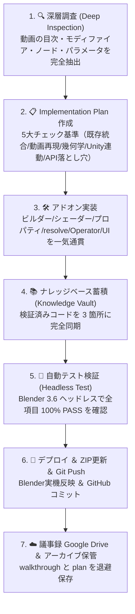

# 🤖 AI エージェント向け Blender 職人学習 ＆ 実装標準運用規程 (AI SOP)

このドキュメントは、**本リポジトリ (`GameModelGen / MeshCreator`) を担当するすべての AI エージェント（Gemini, Claude, GPT 等）が厳格に遵守すべき学習・実装・ナレッジ蓄積の標準プロトコル** です。

本プロジェクトの目的は、YouTube チュートリアルや論文、ユーザーの要望から得られた Blender のプロ技法を単発で終わらせず、**「一子相伝のプロ用資産・知識ベース」として継続的に学習・蓄積・再利用すること** です。

---

## 🏛️ 必須の 7 ステップ学習 ＆ 実装ループ (Standard Learning Loop)

新しい動画 URL や新技術の実装を依頼された場合、必ず以下の 7 ステップを順序立てて実行してください。

---

## 📋 各ステップの具体的な行動規範

### Step 1: 🔍 深層調査 (Deep Inspection)
- YouTube の URL が提示された場合、タイトルや概要欄だけでなく、**チャプター目次、字幕、具体的なモディファイアの種類、数値パラメータ、シェーダーノードの接続関係** を正確に抽出すること。
- 単なる「ノイズを当てる」のような抽象表現で終わらせず、ノード名（`ShaderNodeTexNoise`, `ShaderNodeVolumeAbsorption` など）と具体的数値を特定する。

### Step 2: 📋 実装計画書 (Implementation Plan)
以下の **5 大着眼点** を網羅した計画書（`implementation_plan.md`）を作成し、ユーザーの承認を得る。
1. **既存コード体系への完全統合**: `prop_category`、`PropStudioProperties`、`resolve_prop_parameters`、オペレーター、UI パネルの登録漏れ（KeyError）を完全防止。
2. **動画固有の核心技法の妥協なき再現**: 物理屈折率（IOR 1.333）、ボリューム吸収、Foam 白波属性、二重波紋 Bump 等を妥協なく盛り込む。
3. **形状幾何学の充実**: 平面板ポリで妥協せず、用途に応じた本格幾何学（湖、池底スラブ、プール、泉、海洋など）を設計する。
4. **Unity / ゲーム ＆ サウンド最適化**: マテリアルスロット分離、**足音・接触音（Footstep/Splash Surface ID）** 連動、**Auto PBR Baker によるベタ塗り防止** を必須とする。
5. **Blender API の落とし穴対策**: UV展開直後の `bpy.ops.object.mode_set(mode='OBJECT')` 復帰、`temp_override`、Bmesh 解放をあらかじめ設計に組み込む。

### Step 3: 🛠️ アドオン実装
- `rock_studio_addon.py` に対し、幾何学ビルダー、シェーダーエンジン、UI パネル、プロパティを正確に実装する。
- 必ず構文チェック（`ast.parse`）を実行し、エラーがないことを確認する。

### Step 4: 📚 ナレッジベース永続登録 (3重同期ルール)
新しく習得・実証したコードとノウハウは、必ず以下の **3 箇所** に即座に同期・保存すること。
1. `z:\MeshCreator\blender_knowledge_vault\references\[category]_recipes.md`
2. `C:\Users\kiyot\.gemini\config\skills\blender-master-cookbook\references\[category]_recipes.md`
3. `D:\マイドライブ\BlenderKnowledgeVault\references\[category]_recipes.md`

### Step 5: 🧪 自動テスト検証 (Headless Verification)
- 必ず `blender.exe --background --python test_xxx.py` による自動テストを作成・実行する。
- メッシュの頂点・面数、OBJECT モード復帰、マテリアルノードの接続、IOR 値、FBX エクスポートのすべてが **100% ALL PASS** することを確認する。

### Step 6: 🚀 デプロイ ＆ ZIP更新 ＆ Git Push
- Blender アドオンフォルダ（`C:\Users\kiyot\AppData\Roaming\Blender Foundation\Blender\3.6\scripts\addons\rock_studio_addon.py`）へ上書きコピー。
- `procedural_rock_studio_addon.zip` を再圧縮更新。
- Git コミット＆プッシュを実行。

### Step 7: ☁️ 議事録 Google Drive ＆ アーカイブ保管ルール
- 実装完了時、上書き消去される前の `walkthrough.md` および `implementation_plan.md` を以下の2箇所に日付付きで退避保存すること。
  - **Google Drive**: `D:\マイドライブ\GeminiChatLog\MeshCreator\YYYY-MM-DD_[概要].md`
  - **ローカルアーカイブ**: `z:\MeshCreator\ai_archives\YYYY-MM-DD_[概要].md`

---

## 🎯 ユーザー固有の重要コンテキスト
- **最優先言語**: すべて日本語で応対・記録すること。
- **ユーザープロフィール**: サウンドデザイナー（Cubase、Unity/UE、CRI、Wwise、ADX2）。
  - マテリアル名（例: `Water_Surface_Mat`, `*_Blade_Mat`, `*_Bark_Mat`）は、ゲームエンジン内で **足音・接触音（Surface ID / Physic Material）** に直結する極めて重要なインターフェースであるため、必ずマテリアルスロットを適切に分離すること。
- **無駄な Quota 消費の抑制**: 自動走査や検索インデックスから `ai_archives` や不要な中間ファイルを除外すること。
