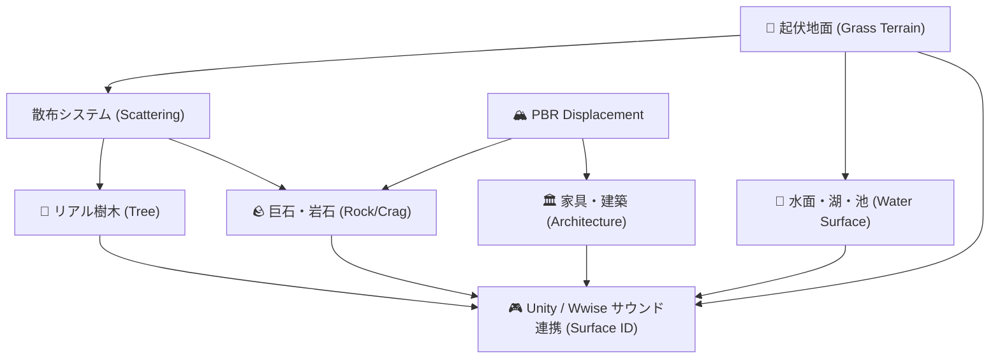

# 📚 Blender Master Knowledge Vault (プロシージャル・アドオン総合開発ガイド)

Blender 3.6+ における **プロシージャル3Dモデリング、シェーダーネットワーク、パーティクル散布、Unity/UE向けゲーム最適化、および Blender Python API の実践ノウハウ** をカテゴリ別に分冊化した永続知識ベースです。

---

## 🧭 カテゴリ別・専門書インデックス (Specialized Recipe Books)

各動画・チュートリアルから得られた一次情報、数式、シェーダーノード構成、Pythonコードは以下の分冊に完全集約されています：

1. 🌲 [**リアル樹木（TREE）生成 ＆ シェーディング完全レシピ**](references/tree_recipes.md)
   - 6大樹種アーキテクチャ（Oak, Pine, Willow, Palm, Birch, Japanese Maple）
   - 3〜4段階フラクタル枝分かれ、根張り（Root Flare）、樹冠球状法線転送（Canopy Normal Transfer）
   - 樹皮縦木目シェーダー ＆ 葉Translucentシェーダー

2. 🌾 [**草原・草地 ＆ 地形プロシージャル生成 完全レシピ**](references/grass_terrain_recipes.md)
   - Mdesign様動画（`nVjq7rn97h0`）準拠
   - 多重サイン波（FBM）起伏地面、UV.Y 5点先細り草ブレード
   - Hair Particle ＋ Collection Render 散布 ＆ 密度頂点グループ
   - ゲーム用メッシュ変換（`disconnect_hair` → `convert(MESH)`）

3. 🏔️ [**PBR ディスプレイスメント ＆ 3D 凹凸立体化 完全レシピ**](references/pbr_displacement_recipes.md)
   - Mdesign様動画（`M_AoNzdC4gI`）準拠
   - PBR テクスチャフルセット自動検知 ＆ Cycles Displacement
   - Displace Modifier ＋ Subdivision による実ポリゴン 3D 頂点立体化

4. 🌊 [**リアル水面・水域スタジオ 完全レシピ**](references/water_shader_recipes.md)
   - 4大水面講座（Flow風アニメ水面、フォトリアル海洋、深海シェーダー、Chuck CG湖・池）
   - IOR 1.333、Volume Absorption、二重波紋Bump、Foam白波属性

5. 🪨 [**岩石・巨石・断崖 プロシージャル生成 完全レシピ**](references/rock_crag_recipes.md)
   - Sacoche Ito式 凸包（Convex Hull）100% ソリッド岩石
   - Chuck CG式 スカルプト不要の多重Displace崖モデリング
   - 直列多重バンプ ＆ ColorRampエッジ風化シェーダー

6. 🏛️ [**家具・建築 プロシージャル生成 完全レシピ**](references/furniture_architecture_recipes.md)
   - アンティーク家具（椅子、テーブル、チェスト、ベッド、本棚）、PCデスク
   - ろくろ挽き脚・装飾柱・アーチ梁・石畳/床タイル/壁ブロック

7. 🎮 [**Unity / Unreal Engine パイプライン ＆ オーディオ連動**](references/game_pipeline_audio.md)
   - FBX エクスポート標準軸（-Z forward, Y up）、スケールベイク
   - マテリアルスロット分離による **足音・接触音（Footstep / Surface Switch）** 連携

8. 🏞️ [**広大背景・グランドキャニオン・山脈 ＆ 巨大地形 完全レシピ**](references/massive_landscape_recipes.md)
   - グランドキャニオン赤色砂岩の水平地層（Stratified Rock）シェーダー
   - A.N.T. Landscape API 自動呼び出し（Canyon, Mountain, Mesa, Ridge）
   - 大気散乱・空気遠近法（Volume Scatter / Mist Pass）

9. 🪵 [**木製の柵・フェンス・砦 プロシージャル生成 完全レシピ**](references/wooden_fence_recipes.md)
   - 4大アーキテクチャ（Post & Rail, Picket, Cross Brace, Palisade）
   - 先端尖り杭（Spike）、横木、X筋交い、木目PBRシェーダー

10. 🌿 [**低木・茂み・シダ植物 プロシージャル生成 完全レシピ**](references/bush_shrub_recipes.md)
    - 4大アーキテクチャ（Round Bush, Wild Shrub, Fern Clump, Hedge Row）
    - 樹冠球状法線転送（Spherical Normal Transfer）による板ポリ感解消
    - 半透明透過光（Translucent）付き葉シェーダー ＆ 細枝チューブ

11. 🍞 [**Auto PBR Texture Baker 仕様書**](references/baking_recipes.md)
    - Blender Headless 環境における Diffuse / Normal / Roughness 自動ベイク
    - Unity インポート時のベタ塗り防止パイプライン

12. ⚠️ [**Blender Python API 虎の巻**](references/blender_api_mastery.md)
    - UV投影後の `OBJECT` モード復帰、ヘッドレス `temp_override`、Bmesh 解放

---

## 🔗 クロス・プリセット連携マップ (Cross-Preset Integration)

各カテゴリの技術は以下のように相互にシームレス連携します：



---

## 🛡️ AI 学習破綻防止チェックリスト（実装前に必ず実行）

> **詳細は [`z:\MeshCreator\AI_LEARNING_RULES_FOR_GEMINI.md`](../../AI_LEARNING_RULES_FOR_GEMINI.md) を必ず確認すること。**

```
実装前:
  □ LEARNING_SOURCES.md を view_file で読んだか？
  □ 対象プリセットの references/*.md を view_file で実際に読んだか？
  □ YouTube URL の一次情報パラメータを確認したか？

実装後:
  □ python -m py_compile で全モジュールの構文チェックを実行したか？
  □ blender.exe --background --python test_*.py で実機テストを実行したか？
  □ 新たに実証したコード・数式を references/*.md に追記したか？
  □ 1責務 1コミットで Git コミット＆プッシュしたか？
```
