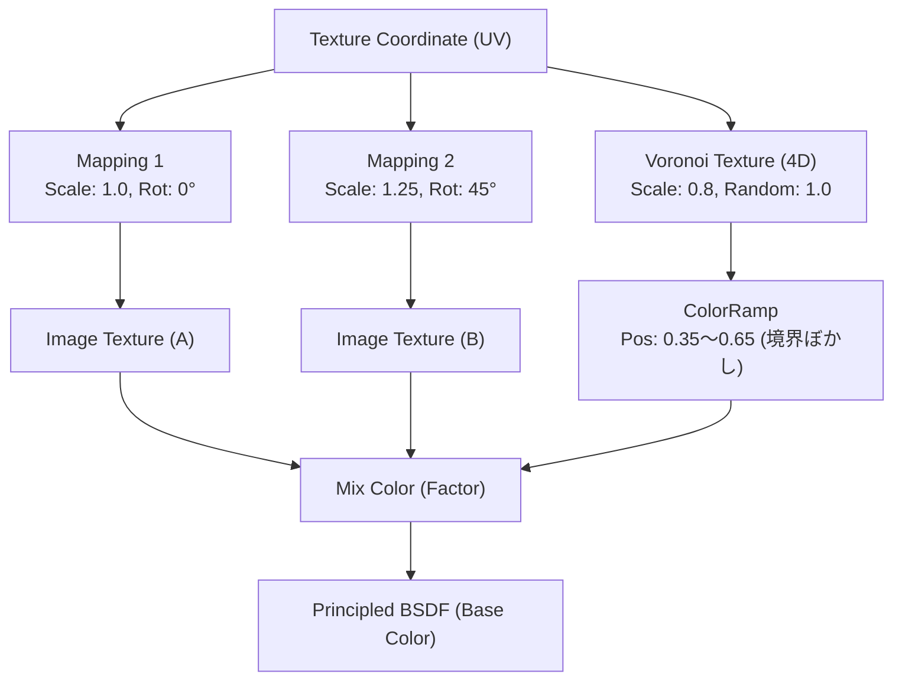

# 🧱 テクスチャのリピート感（タイリング）完全解消レシピ (Anti-Tiling Master Recipe)
> **基準動画**: 『【Blender3.0】テクスチャのリピート感をなくす方法【カンタン5分】』（`RznTixuimgk`）

---

## 🎯 1. なぜテクスチャに「リピート感」が出てしまうのか？

地面（土・草・砂・石畳）や広い壁に画像テクスチャをタイリング（リピート `Tiling: 4.0` など）すると、**同じ特徴的な染みや模様が等間隔の格子状に並んでしまい、一目でCGの張りぼてだと分かってしまう現象** が発生します。

---

## 🛠️ 2. 具体的なノード構築手順 ＆ 設定パラメータ

### 📋 各ノードの具体的設定値一覧

| ノード名 | 設定プロパティ | 推奨設定値 | 目的・役割 |
| :--- | :--- | :--- | :--- |
| **Texture Coordinate** | 出力ソケット | `UV` または `Object` | テクスチャの基本座標 |
| **Mapping 1** | Scale / Rotation | `Scale: (1.0, 1.0, 1.0)` `Rotation: 0°` | 基準となるテクスチャ配置 |
| **Mapping 2** | Scale / Rotation / Location | `Scale: (1.25, 1.25, 1.25)` `Rotation: 45°` (または `Location: (12.3, 45.6, 0)`) | 角度とスケールをずらした第2テクスチャ配置 |
| **Voronoi Texture** | Type / Feature Scale / Randomness | **`4D`** / **`F1`** / **`Euclidean`** **`Scale: 0.8〜1.2`** **`Randomness: 1.0`** | 不規則なセル状のランダム領域マスクを作成 ※`W` スライダーでシード値を変更可能 |
| **ColorRamp** | ストップ位置 | **黒(0.0): `0.35`** **白(1.0): `0.65`** | セル境界を滑らかにぼかし、テクスチャ同士を自然にフェードブレンド |
| **Mix Color** | Data Type / Mode | `RGBA` / `Mix` `Factor`: ColorRamp の出力 `A`: Mapping 1 のテクスチャ `B`: Mapping 2 のテクスチャ | 2種類の異なるテクスチャをボロノイ領域ごとに自動合成 |

---

## 💡 3. Normal Map（法線マップ）への適用時の注意点

法線マップ（Normal Map）に Anti-Tiling を適用する場合、直接カラー合成した後に `Normal Map` ノードに渡すと、角度の異なる法線ベクトルが混ざり合ってシェーディングの乱れが起きることがあります。

### ✅ 法線マップの正しいブレンド法:
1. `Mapping 1` → `Image (Normal A)` → `Normal Map ノード 1`
2. `Mapping 2` → `Image (Normal B)` → `Normal Map ノード 2`
3. 2つの Normal 出力を **`Mix Color`（または `Mix` ノード / Factor: ColorRamp）** で合成して Principled BSDF の `Normal` に接続する。
