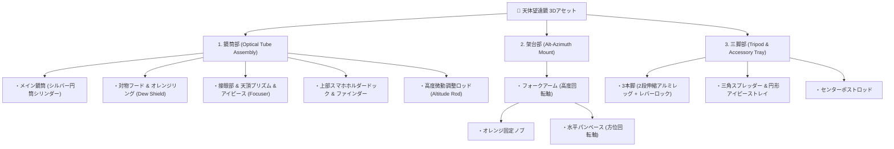

# 🔭 天体望遠鏡（Celestron StarSense Explorer LT風）3Dモデル化設計書 ＆ プロセス検討

## 🎯 1. 対象アセットの特定とパーツ構造分解

添付画像のアセットは、**「Celestron StarSense Explorer LT」シリーズの経緯台屈折式天体望遠鏡（Refractor Telescope）** です。

---

## 🎬 2. 動画（`Jdz1I223oFw`）の学習内容と望遠鏡への適用検討

### 📺 動画『Generate 3D Elements from Image in Blender』の手法
1. **深度マップ（Depth Map）生成**: 2D画像を白黒の深度画像に変換。
2. **Grid / Plane 分割 ＆ Displace**: 白黒の明暗をもとにメッシュを押し出し。

### ⚠️ 望遠鏡モデリングにおける適性判断
- **深度マップ手法の得意分野**: コイン、壁のレリーフ、岩肌、布など「片面が凸凹した板状オブジェクト」。
- **望遠鏡（ハードサーフェス）への適性**:
  望遠鏡は **「中空パイプ」「3本脚の立体交差」「回転軸」** で構成されているため、深度マップからの一発変形では裏側が埋まり、綺麗な円筒になりません。
- **結論（最適モデリング手法）**:
  画像を **「背景参照画像（Reference Image: `Empty Image`）」** として正面・側面に配置し、**円筒（Cylinder）と立方体（Cube）のハードサーフェスモデリング** で構築するのが最も美しく、ゲームでも完璧に動く最適解です。

---

## 🛠️ 3. 望遠鏡のステップ別 3D モデリングプロセス

### Step 1: 下絵（Reference Image）の配置
1. Blender で `Shift + A` → `Image` → `Reference` で添付画像を配置。
2. 望遠鏡の全高（約 `1.2m〜1.4m`）に合わせてスケールを調整。

### Step 2: 鏡筒部（OTA）のモデリング
1. **メイン鏡筒**: `Cylinder`（頂点数 `16〜24`）、直径約 `90mm`、長さ約 `700mm`。
2. **対物フード**: 先端を `Extrude (E)` → `Scale (S)` でフレア状に広げ、厚み付け（`Solidify` または Inset）。
3. **接眼部（Focuser）**:
   - 鏡筒後端に段差を付け、細いドローチューブを押し出し。
   - `Cylinder` でフォーカスノブ（ピント合わせダイヤル）を左右に配置。
   - 90度エルボ状に曲げた天頂プリズム（Star Diagonal）とアイピース（接眼レンズ）を作成。
4. **スマホホルダー / ファインダー**:
   - 鏡筒上部にベースマウントを作成。
   - クランプ状のスマホドック（上部の爪）をボックスモデリング。

### Step 3: 架台部（Mount）のモデリング
1. **フォークアーム**: 鏡筒を挟み込むアームを作成。
2. **高度微動ロッド**: 鏡筒下部から架台へ伸びる細いシリンダーロッドと、オレンジ色の調整ネジノブを配置。
3. **回転ピボットの設定**: 鏡筒が上下（仰角）にスムーズにチルトできるように、**回転原点（Pivot）を高度軸の中心に設定**。

### Step 4: 三脚部（Tripod）のモデリング
1. **脚（Legs）**:
   - 上段レッグ（角丸断面または2本パイプ）と下段細レッグ（伸縮部）。
   - 中間にレバーロック（開閉バックル）を作成。
   - 1本の脚を作成後、**360° / 3 = 120° 回転複製（Spin / Array / 3D Cursor回転）** で3本脚を展開。
2. **アクセサリトレイ**:
   - 中央の支柱から広がる3本のアーム。
   - 円形トレイ板を作成し、アイピースを挿す丸穴（Boolean またはテクスチャ）を配置。

---

## 🎨 4. マテリアル構成（4つの質感スロット）

| スロット名 | 色 / 質感 | パラメータ設定 | 適用パーツ |
| :--- | :--- | :--- | :--- |
| **① `Mat_Telescope_Body`** | ライトシルバー / サテンアルミ | Base: `#C8CDD2`, Metallic: `0.85`, Roughness: `0.25` | メイン鏡筒本体 |
| **② `Mat_Telescope_Black`** | マットブラック / 樹脂・アルミ | Base: `#1A1B1D`, Metallic: `0.2`, Roughness: `0.45` | 三脚、接眼部、マウント、フード先端 |
| **③ `Mat_Celestron_Orange`** | セレストロン・シグネチャーオレンジ | Base: `#E65100`, Metallic: `0.0`, Roughness: `0.35` | 鏡筒のアクセントリング、各部固定ノブ |
| **④ `Mat_Telescope_Glass`** | 光学レンズガラス | Base: `#D0E8F0`, Transmission: `0.95`, IOR: `1.52`, Roughness: `0.02` | 対物レンズ、アイピース先端 |

---

## ❓ 5. 検討・確認したいポイント（不明点・仕様確認）

1. **Unityでの用途とポリゴン数**:
   - **ゲーム用ローポリ（背景/プロップ）**: `1,500〜3,500` トリス（軽量・ベイク対応）
   - **ハイエンド / インタラクティブ観察用**: `8,000〜15,000` トリス（ネジやボルトまで精密再現）
2. **可動ギミック（親子階層構造）**:
   - **静止プロップ（1つの結合メッシュ）** として出力するか、
   - **「三脚（固定）」「架台（左右回転）」「鏡筒（上下仰角チルト）」** を別パーツとして親子付けし、Unity上でプレイヤーが星空を覗くインタラクションができるようにするか。
3. **ロゴデカール（`StarSense EXPLORER LT`）**:
   - テクスチャ画像（デカール）として貼り付けるか、プロシージャルな質感のみにするか。
